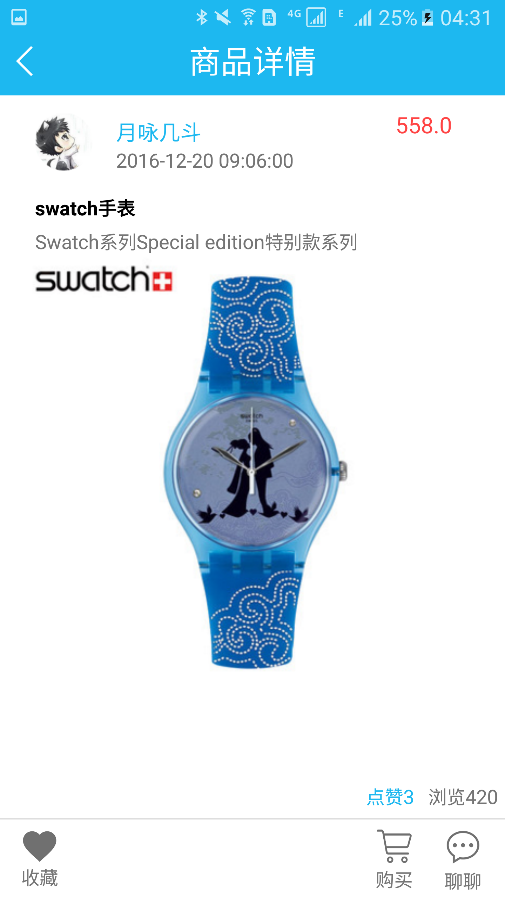
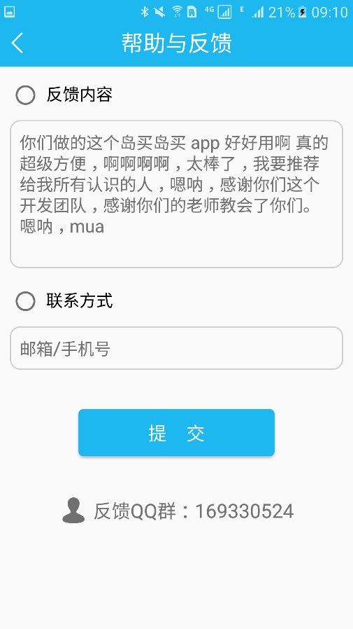

#2014级Java方向实训项目展示

---------

### 项目：岛买岛卖

* [Github](https://github.com/xujihui/IslandTrading) 
* [HostedRedmine](http://www.hostedredmine.com/projects/island/wiki)

#### 项目简介

**岛买岛卖**是一款面向大学生的二手交易app。每一所大学都像是城市里的一座岛，学校里的大学生是岛上的居民，大学生的二手交易称之为买卖，于是有了——岛买岛卖。
岛买岛卖旨在为大学生提供一个方便，快捷的二手交易平台，如今大学生同校二手交易主要运用QQ作为媒介发布消息，消息浏览不便且信息更新不及时，过程繁琐。岛买岛卖采用了一种新型独特的商品展示方式，以地图为载体，在卖家发布商品的地点直接展示商品，商品信息浏览更加方便直观，商品信息实时更新，除了有新型地图页商品展示方式，传统的列表显示方式依然存在。岛买岛卖还实现了实时聊天的功能，使双方的交易更加方便、快捷。

#### 项目成员

* 徐继辉 (项目经理，产品，UI设计，客户端代码开发) 
    * Email: <805991134@qq.com>
    * Github : [https://github.com/xujihui](https://github.com/xujihui)
* 刘鑫 (服务器代码开发，产品) 
    * Email: <960007435@qq.com>
    * Github : [https://github.com/liuxin2017](https://github.com/liuxin2017)
* 张丽璇 (客户端代码开发，测试)
    * Email: <593160444@qq.com>
    * Github : [https://github.com/zhanglixuan](https://github.com/zhanglixuan)
* 韩晨 (客户端代码开发，测试)
    * Email: <441007713@qq.com>
    * Github : [https://github.com/LuHoney7/](https://github.com/LuHoney7/)
* 李江 (客户端代码开发，测试)
    * Email: <787325997@qq.com>
    * Github : [https://github.com/NinaLJ](https://github.com/NinaLJ)
* 孙铖 (服务器代码开发，测试)
    * Email: <1159477889@q.com>
    * Github : [https://github.com/suncheng2017](https://github.com/suncheng2017)

#### 运行效果
    

    

    

  