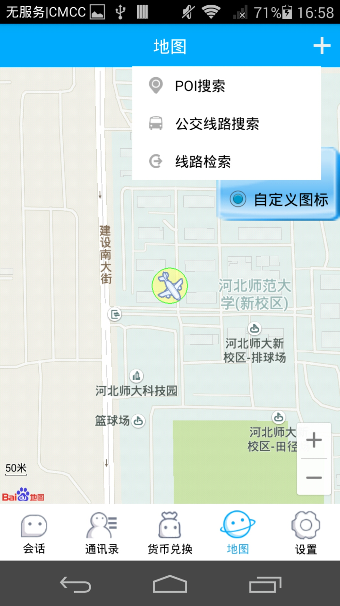
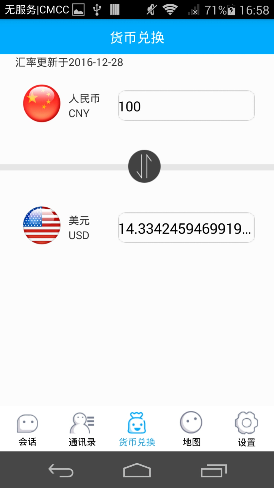
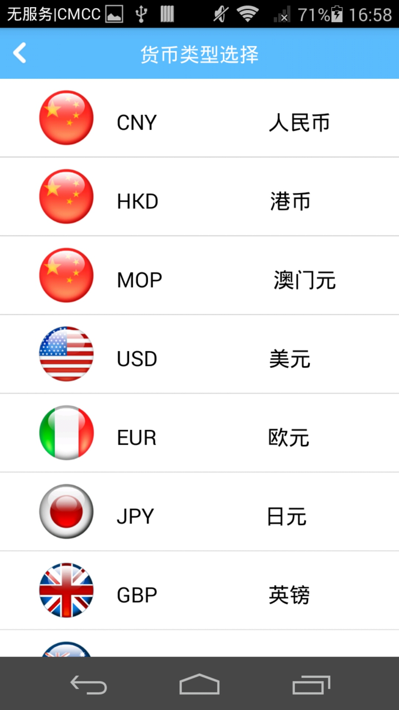
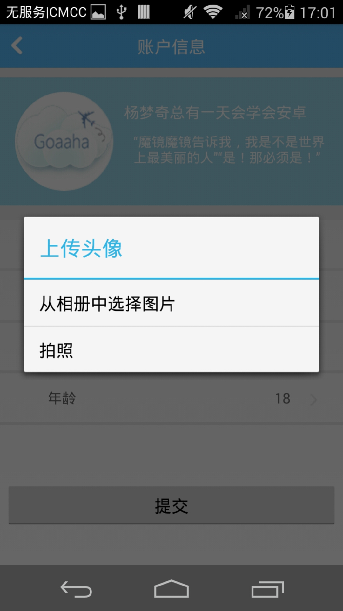
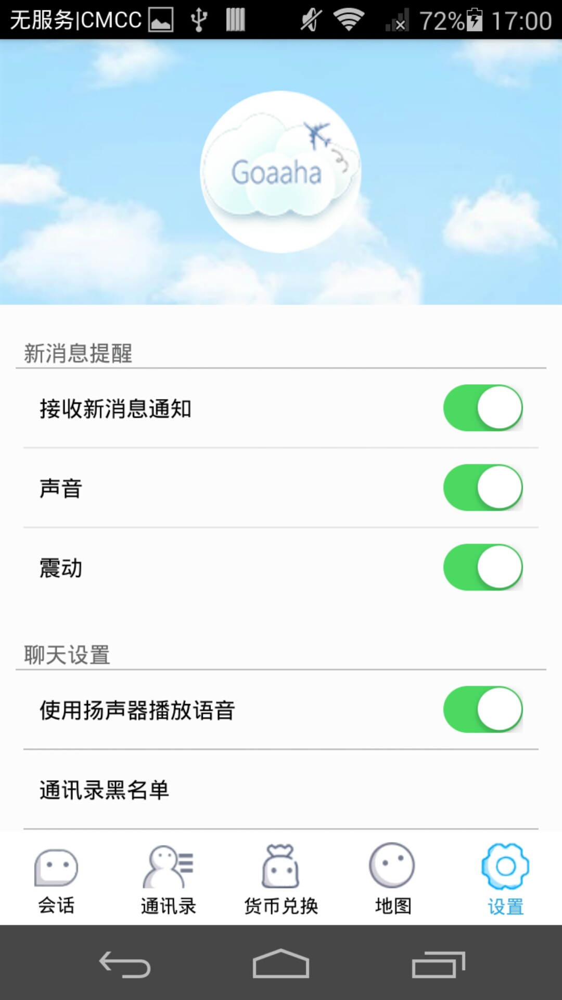
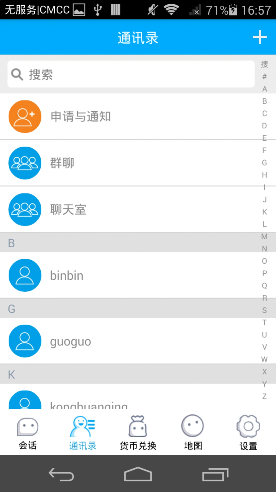
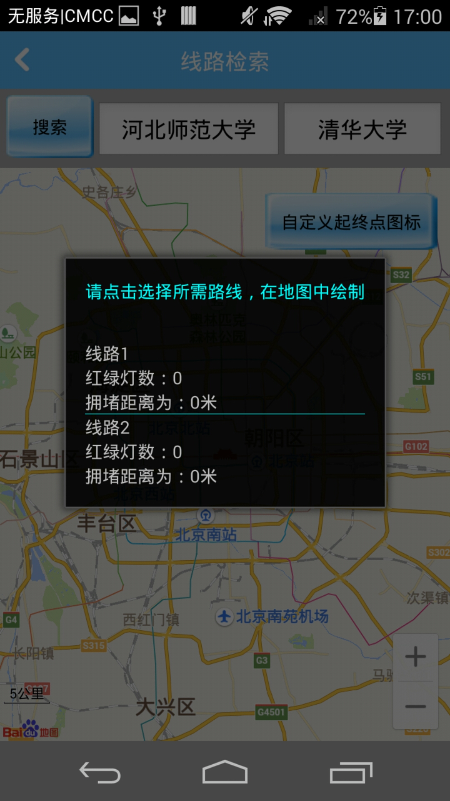
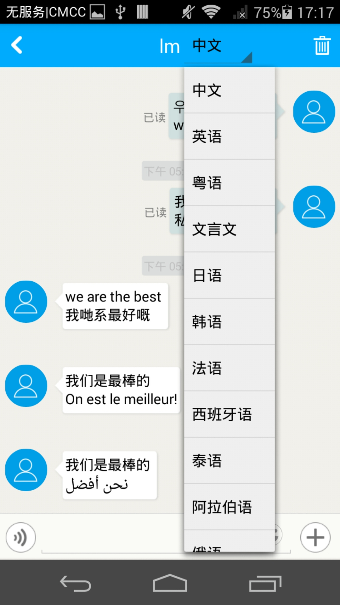
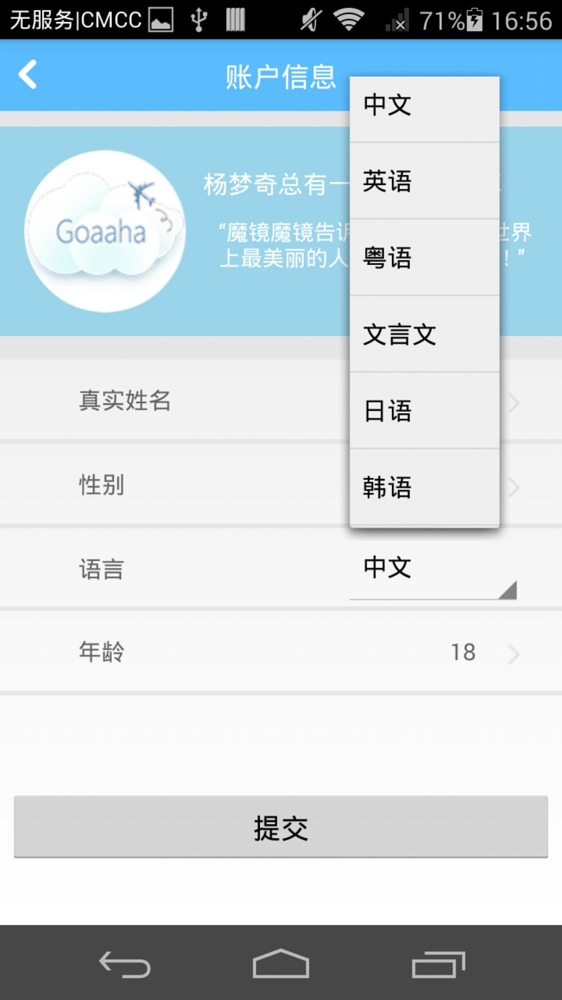

#Goaaha

* [Github](https://github.com/yangmenqi/Goaaha) 
* [HostedRedmine](http://www.hostedredmine.com/projects/java-_goaaha/wiki)

### 项目简介

**Goaaha**——Go abroad as at home,像在家一样出国（官方指定解释，因为这是goaaha自己翻译的~~）。沟通从不应该被语言所阻隔，生活质量也从不应该被地域所影响。

Goaaha作为出国留学、工作、游玩必备App共有三个主要功能，其中核心功能为聊天同步翻译即注册的用户之间聊天发送时同时显示原文和译文，支持多种语言之间相互翻译；第二大功能为货币兑换，支持多种货币类型之间金额兑换；第三大功能为应用地图，个人定位、POI搜索、公交线路搜索、路线搜索均可实现。不仅仅是出国需要用到，与各国合作伙伴、好朋友的交流怎么能缺少Goaaha！Goaaha的心愿是世界和平！

### 项目成员

* 杨梦奇 (项目经理，UI设计，客户端代码开发，测试) 
    * Email: <719944159@qq.com>
    * Github : [https://github.com/yangmenqi](https://github.com/yangmenqi)
* 刘萌 (UI设计，客户端代码开发，测试) 
    * Email: <1853798011@qq.com>
    * Github : [https://github.com/LiuMengM](https://github.com/LiuMengM)
* 朱晓彬 (客户端代码开发，测试) 
    * Email: <182354572@qq.com>
    * Github : [https://github.com/sumozhuxiaobin](https://github.com/sumozhuxiaobin)
* 孔还庆 (客户端代码开发，服务器代码开发，测试) 
    * Email: <775323759@qq.com>
    * Github : [https://github.com/ konghuanqing](https://github.com/ konghuanqing)
* 周翔 (客户端代码开发，测试) 
    * Email: <737042201@qq.com>
    * Github : [https://github.com/zhouxiang0418](https://github.com/zhouxiang0418)
* 郑子奇 (客户端代码开发，测试) 
    * Email: <280633946@qq.com>
    * Github : [https://github.com/zhengziqi123](https://github.com/zhengziqi123)	
* 祁晓宇 (客户端代码开发，测试) 
    * Email: <598943846@qq.com>
    * Github : [https://github.com/qixiaoyu233](https://github.com/qixiaoyu233)
	
### 运行效果

