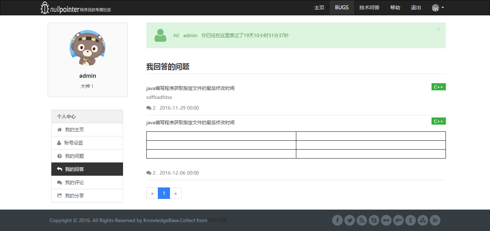
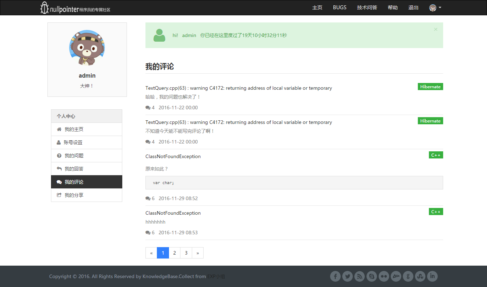
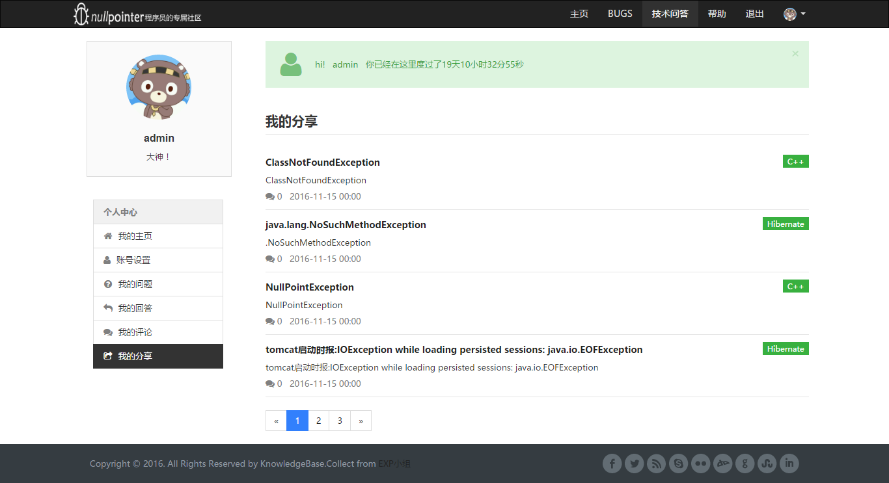
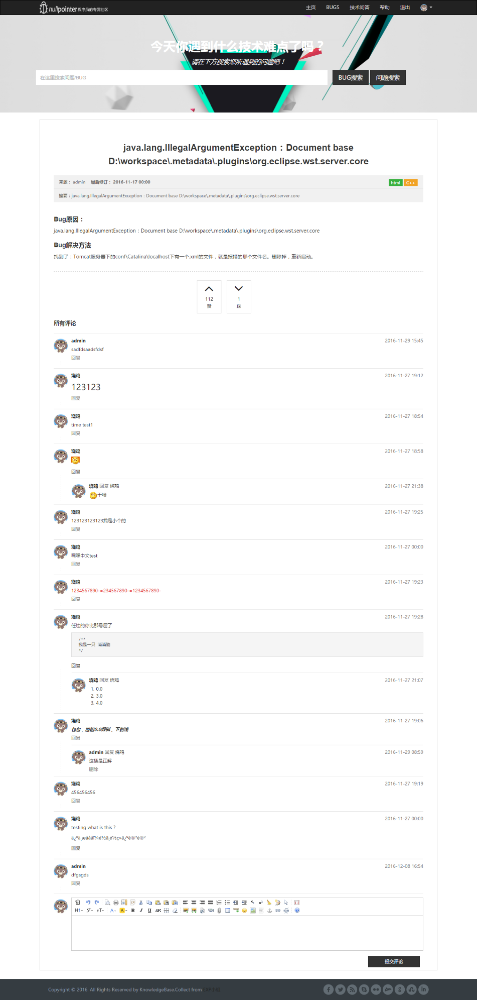
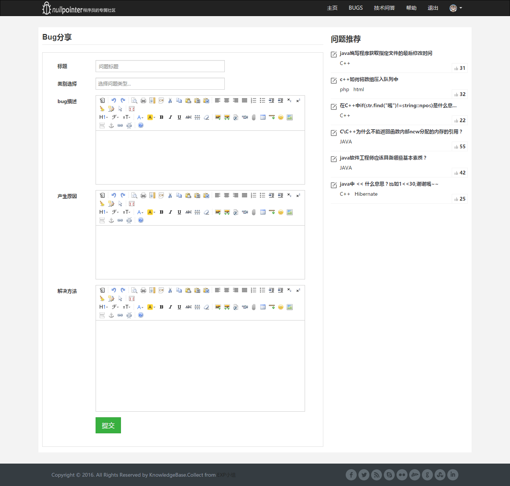

#nullpointer

* [Github](https://github.com/MrFengStu/nullpointer) 
* [HostedRedmine](http://www.hostedredmine.com/projects/java_nullpointer/wiki)

### 项目简介

**nullpointer**项目主要是为了聚集程序中经常出现的bug，减少程序员调试程序的时间，提高程序员的工作效率，同时，nullpointer网站提供技术问答的平台，为程序员指点迷津。

nullpointer 为一个bug的名称，类似于国外的stackoverflow，我们致力于打造为国内程序员服务的分享社区。

### 项目成员

* 冯廷鑫 (项目经理、开发工程师) 
    * Email: <1552068029@qq.com>
    * Github : [https://github.com/MrFengStu](https://github.com/MrFengStu)
* 张肇霖 (产品经理、UI设计、开发工程师) 
    * Email: <626344962@qq.com>
    * Github : [https://github.com/zhangzhaolin](https://github.com/zhangzhaolin)
* 颜荣恩 (测试工程师、开发工程师、用户体验) 
    * Email: <2601219524@qq.com>
    * Github : [https://github.com/dadadaray](https://github.com/dadadaray)	
* 汤文茹 (测试工程师、开发工程师、用户体验) 
    * Email: <tangwenru1996@gmail.com>
    * Github : [https:/github.com/twr2016](https:/github.com/twr2016)	

### 运行效果

