#不等号

* [Github](https://github.com/shihangqi/Project) 
* [HostedRedmine](http://www.hostedredmine.com/projects/sign_of_inequality/wiki)

### 项目简介

排队机只是一种将来话均匀分配以及提供人工或自动应答的设备，没有提供较多的功能。随着各行各业业务量的快速发展，各行业业务承受的压力越来越大，排队等待现象屡见不鲜，各行业排长队现象成为困扰行业和用户的难题，目前大部分行业的营业厅都使用了取号系统来改善银行窗口排长队的现象，虽让在一定程度上提高了服务效率，但是还是存在排队时间长，站错队，排队时无聊，浪费大量宝贵时间等问题。

使用我们的**不等号**，一方面可消除用户长时间“站队”的辛苦、对“站错队”、“插队”的抱怨，避免发生排错队和混乱噪杂的现象，减少许多不必要的纠纷，全面改善服务质量和企业形象，另一方面更可以依据统计数据调整业务分配、挖掘潜力、合理安排窗口服务，减少群众的等候时间，提高办事效率。

同时，排号系统支持多种形式的排队，可依照业务的种类或用户种类进行排号。支持对特殊对象（会员）的优先服务。支持多道手续的自动转移。只要用手机轻轻一扫就能排队以满足业务大厅有多个出入口的自然环境。我们还设置了提醒功能，可以让您在排队的同时去做其他事，大大节您的时间。

### 项目成员

* 石航琪 (项目经理) 
    * Email: <183521065@qq.com>
    * Github : [https://github.com/shihangqi](https://github.com/shihangqi)
* 陈晨 (产品经理) 
    * Email: <810715640@qq.com>
    * Github : [https://github.com/xiaoguizimou](https://github.com/xiaoguizimou)
* 公菲菲 (UI设计、开发工程师) 
    * Email: <2820991866@qq.com>
    * Github : [https://github.com/gongfeifei](https://github.com/gongfeifei)
* 张增科 (开发工程师) 
    * Email: <1114873401@qq.com>
    * Github : [https://github.com/a1114873401](https://github.com/a1114873401)
* 李泽 (开发工程师) 
    * Email: <lize080887@126.com>
    * Github : [https://github.com/Ruthless-old-Lize](https://github.com/Ruthless-old-Lize)
* 杨亚旺 (测试工程师) 
    * Email: <598189036@qq.com>
    * Github : [https://github.com/yangyawang](https://github.com/yangyawang)

### 运行效果
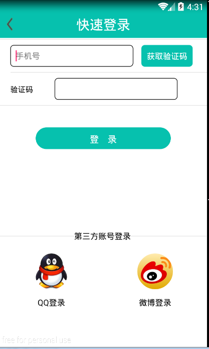
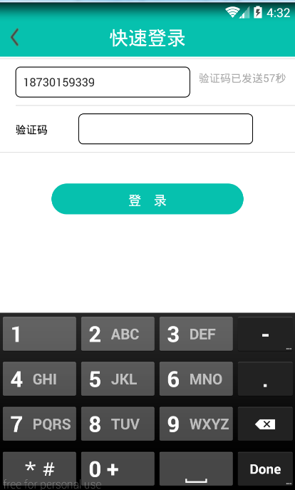

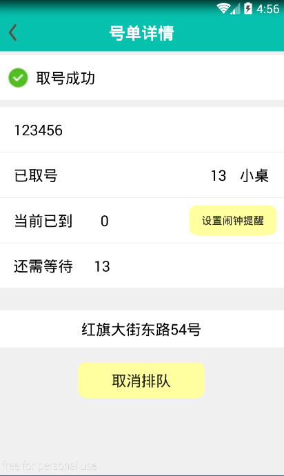
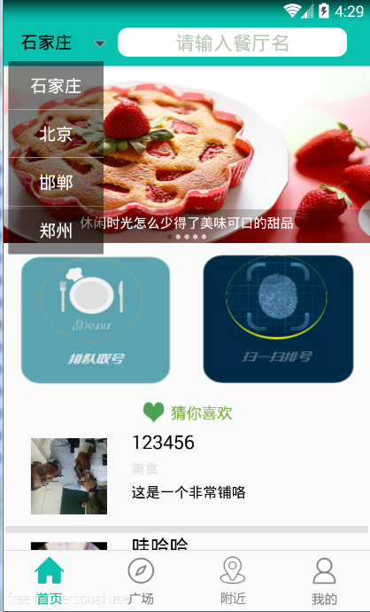
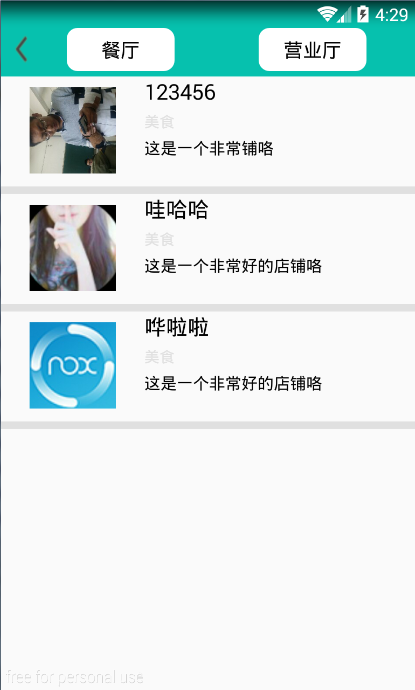

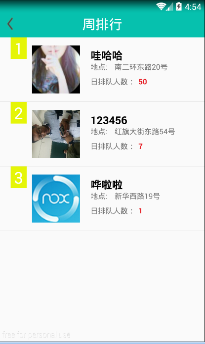
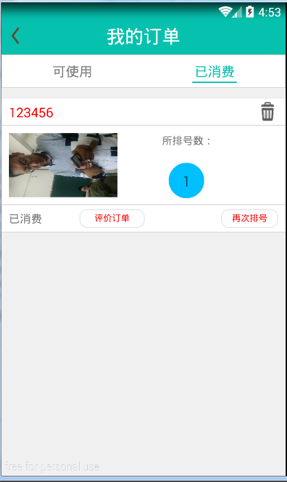
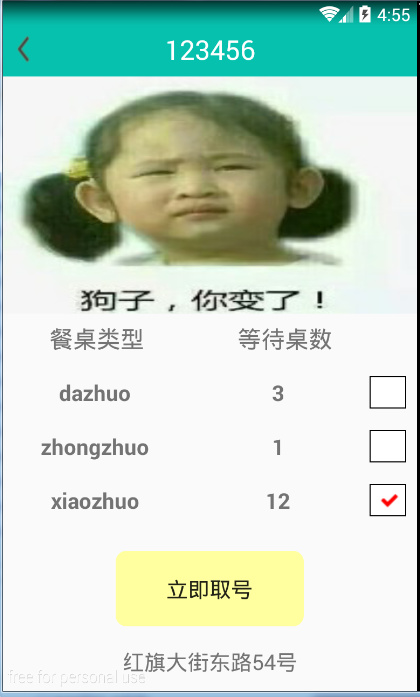

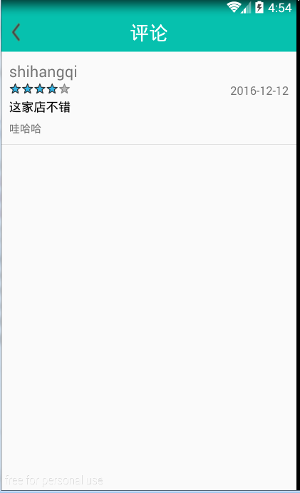
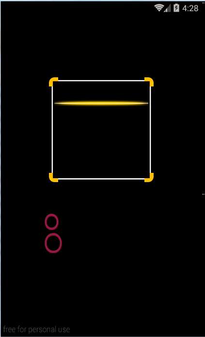
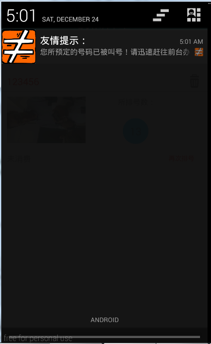

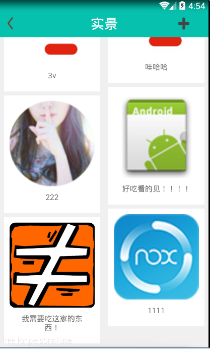
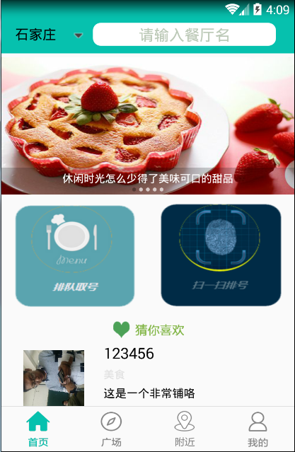
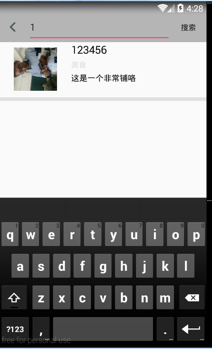

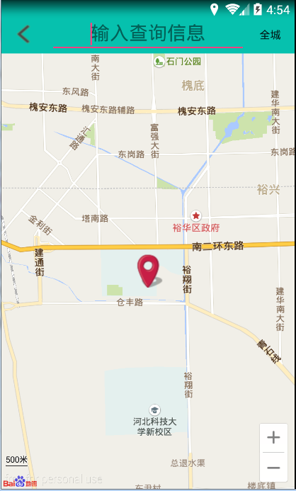
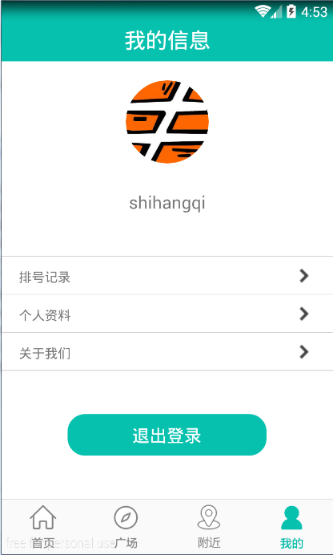
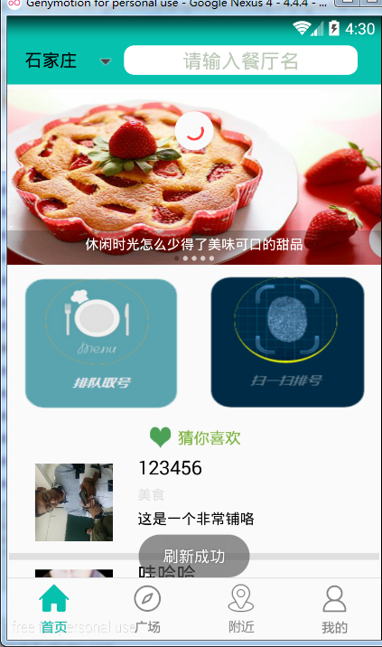

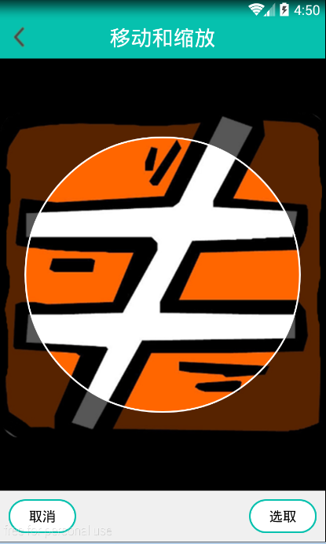
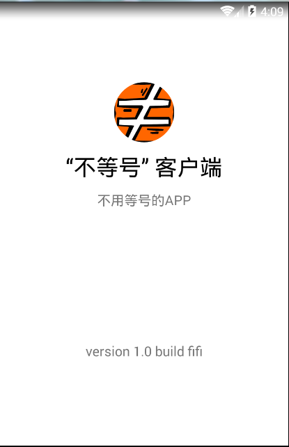

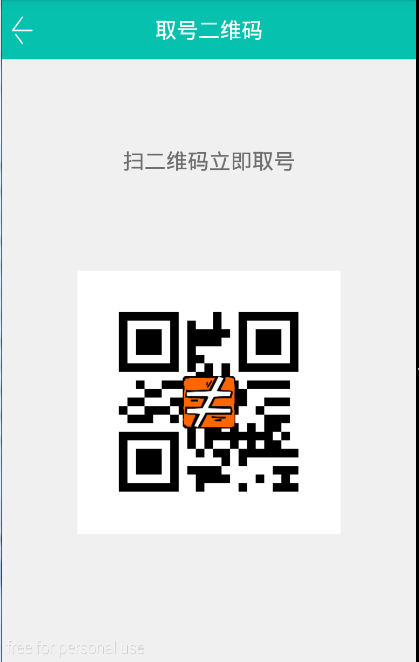
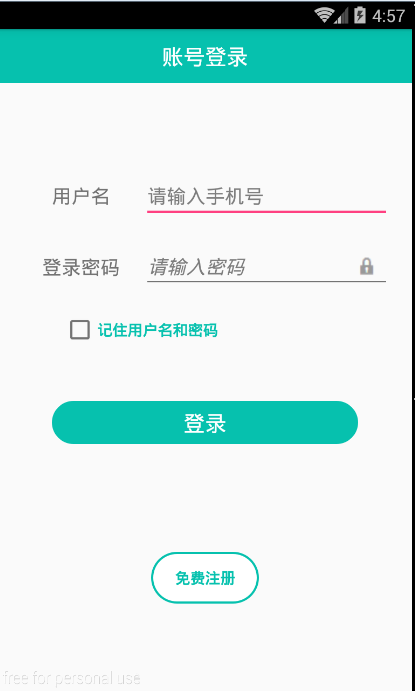
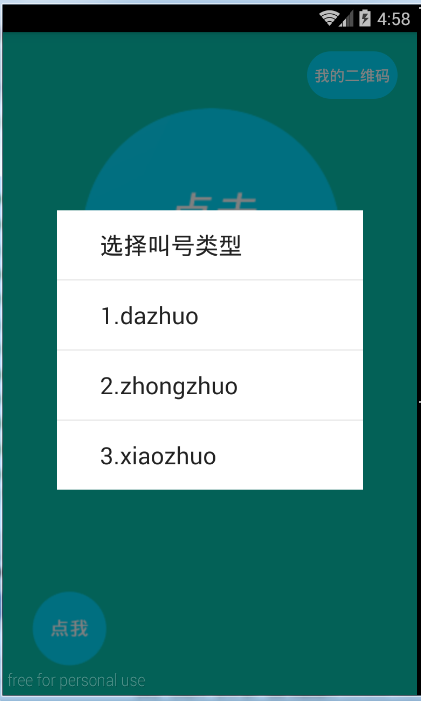

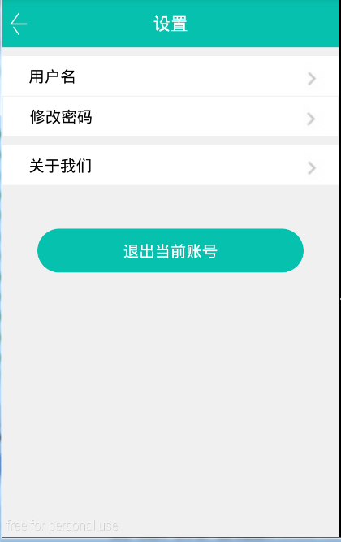
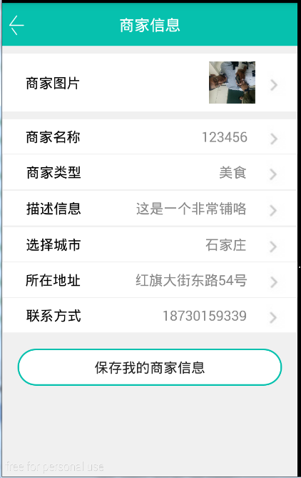
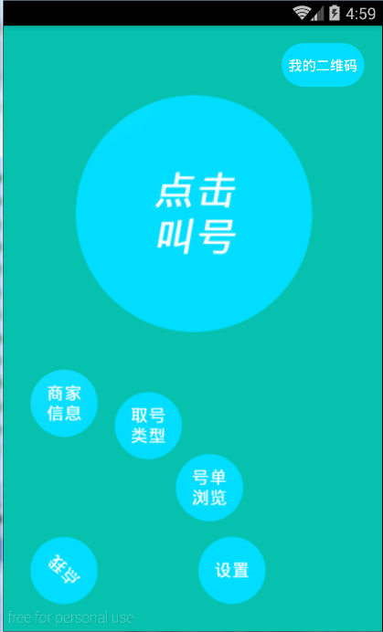

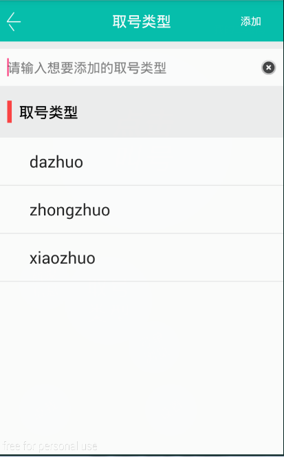