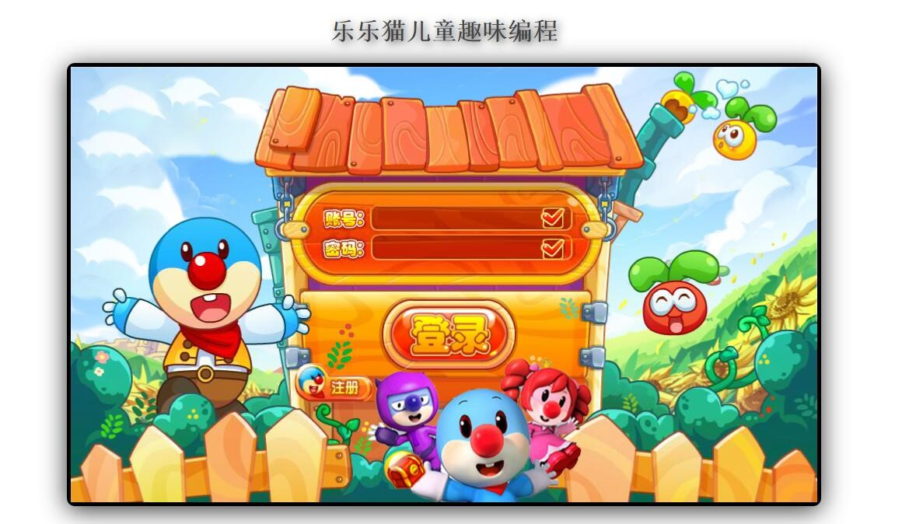
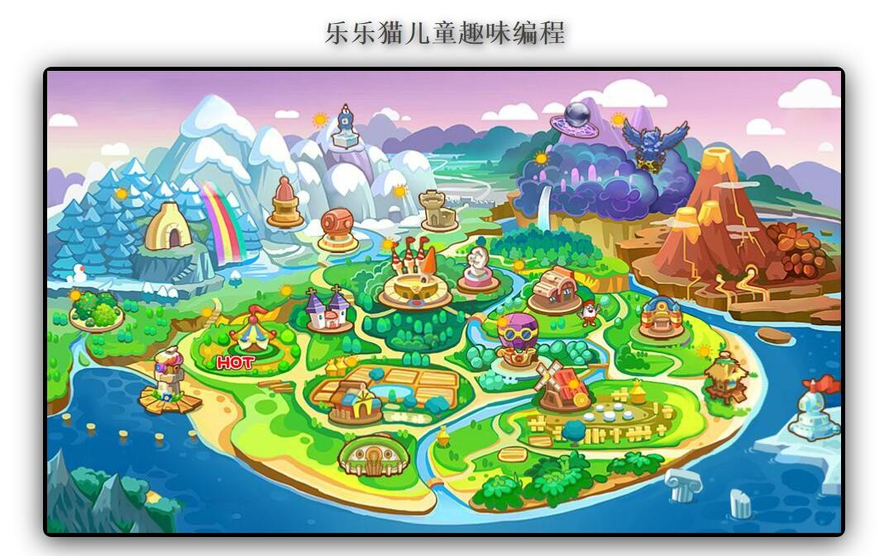
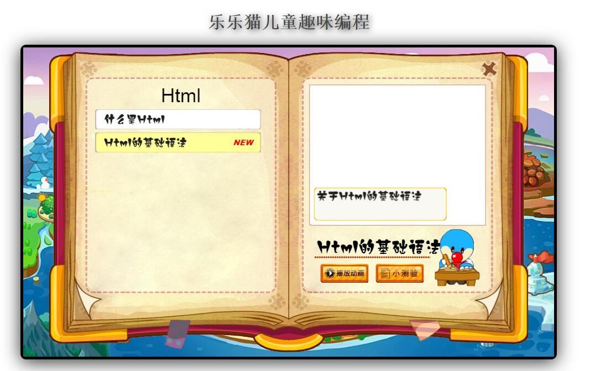
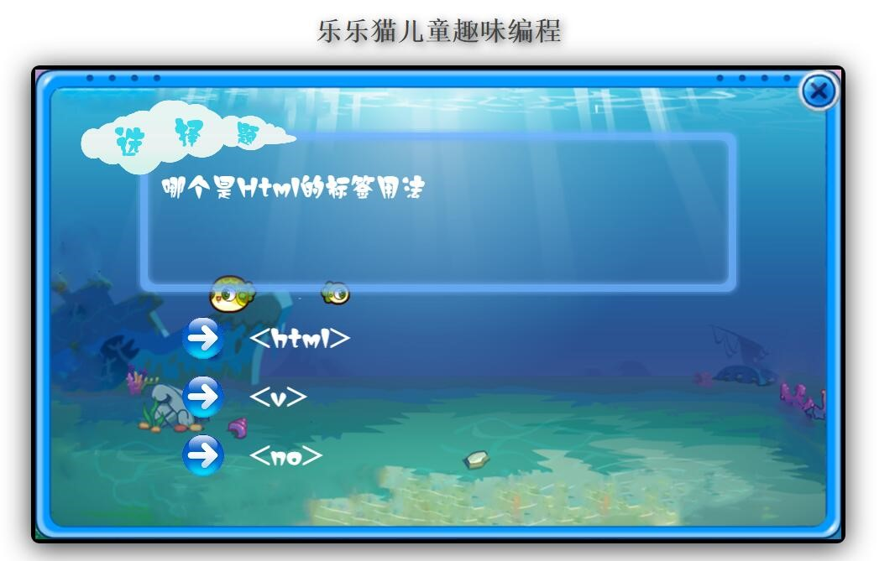
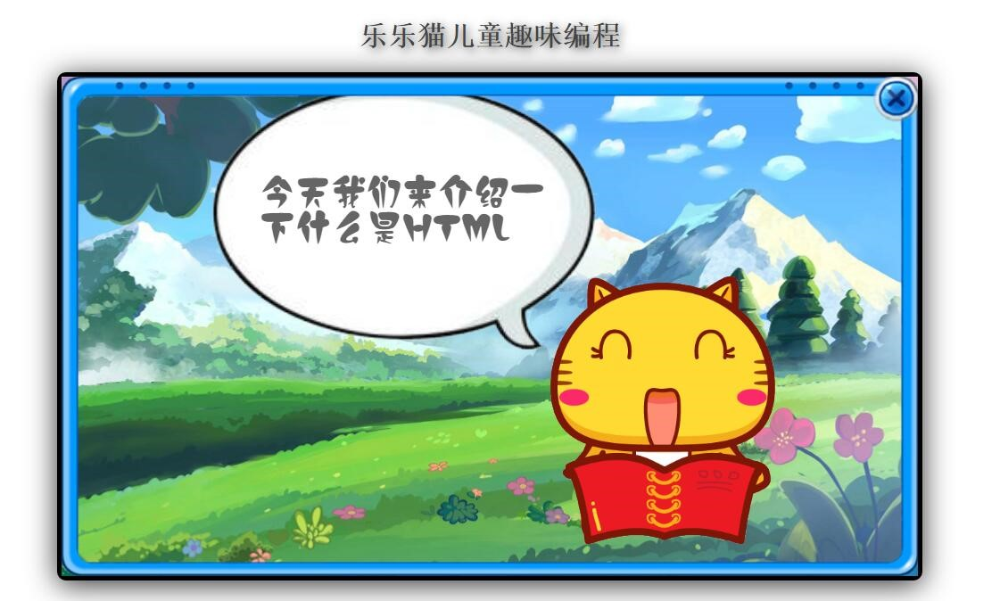
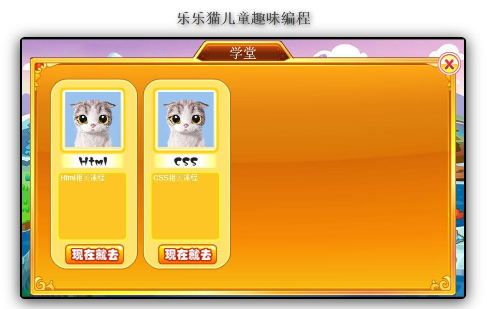
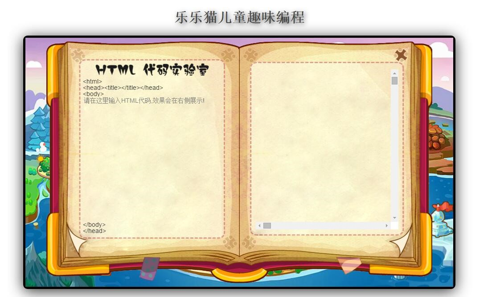
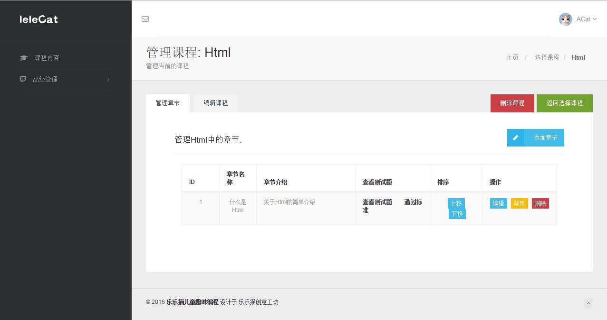
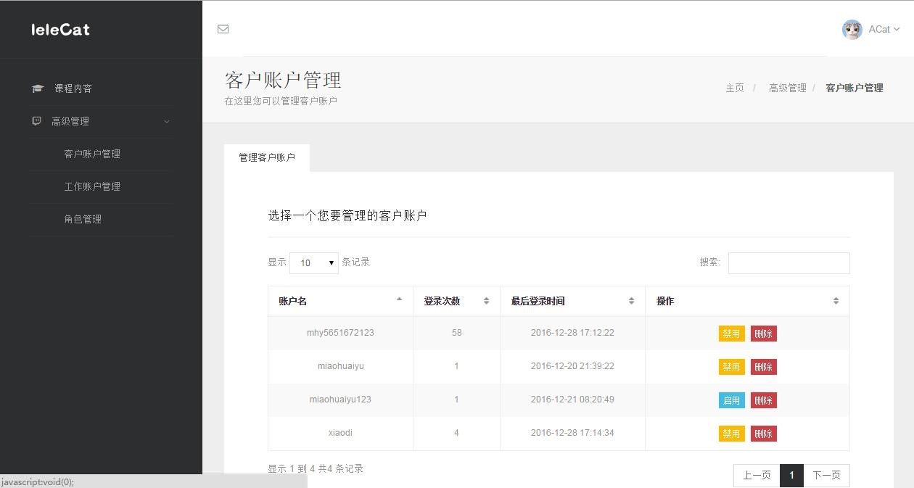

#乐乐猫儿童趣味编程学习网

* [HostedRedmine](http://www.hostedredmine.com/projects/lelecatprogramming/wiki)

### 项目简介

电子科技的时代，蓬勃发展的科技行业，个人编程能力将越来越重要，国外早已认识到儿童编程学习的重要性，而在国内这一切则处于刚刚起步阶段。随着家长们思想水平的提升，不再过度依赖应试教育，越来越多家长会意识到编程的重要性，会愿意让孩子接触编程，学习编程，因此儿童编程教育的前景非常广阔。

**乐乐猫儿童趣味编程网**提供一个针对儿童的在线编程学习的平台，针对不同年龄段儿童提供不同的学习方式，通过种种充满趣味的方式向儿童展示编程的美，激发儿童对编程的兴趣，甚至可以亲子共同参与学习，让编程学习不再枯燥无味。

### 项目成员

* 孙健 (项目经理)  Email: <sunjian0602@163.com>
* 王冀琛 (开发工程师)  Email: <1843600144@qq.com>
* 王子恒 (开发工程师)  Email: <871898843@qq.com>
* 崔坤硕 (开发工程师)  Email: <997553287@qq.com>
* 张欢 (开发工程师)  Email: <994494858@qq.com>
* 苗怀雨 (开发工程师)  Email: <616396021@qq.com>

### 运行效果

