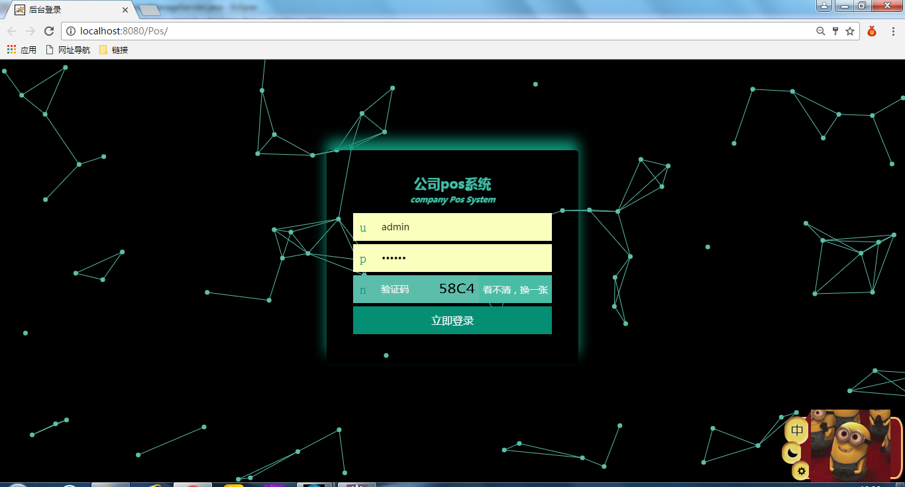
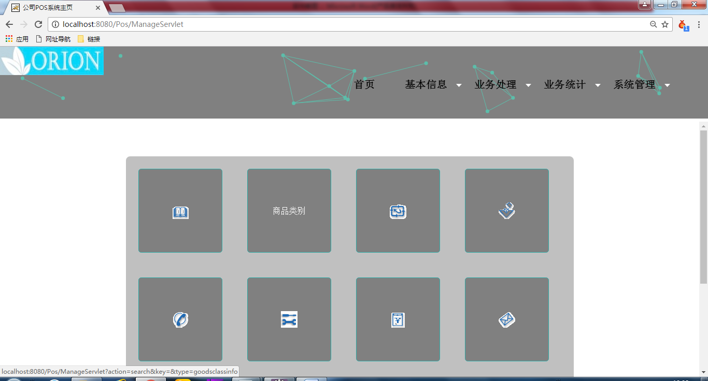

#公司POS系统

* [Github](https://github.com/zhangdi2014/Company-POS-system) 
* [HostedRedmine](http://www.hostedredmine.com/projects/pos/wiki)

### 项目简介

公司随着市场经济和现代信息技术的发展，不可必要卷入信息现代化的大潮，如何使用现代化工具，使公司和管理者个人在最小的投入下去的最大的回报，成为每个管理者的梦想，因此，在公司管理中引进现代化的办公软件，就成为了当下最好的解决办法。

使用软件办公，不仅能使管理者的劳力资本减少，同事能使公司的管理更规范合理，解决了公司对于商品资料的管理，商品的类别，商品的进出货，商品的采购，商品的库存等众多繁琐、工作量巨大从而导致耗费人员过多，公司经营紊乱等众多问题。有鉴于此我们想到了一种解决方案,即**公司POS（商品的管理）系统**。

### 项目成员

* 张迪 (项目经理) 
    * Email: <153813881@qq.com>
    * Github : [https://github.com/zhangdi2014](https://github.com/zhangdi2014)
* 李晓阳 (产品经理) 
    * Email: <1060244541@qq.com>
    * Github : [https://github.com/Paul12334](https://github.com/Paul12334)	
* 董玉韩 (UI设计、开发工程师) 
    * Email: <1309449496@qq.com>
    * Github : [https://github.com/dongyuhan](https://github.com/dongyuhan)	
* 孙成 (开发工程师) 
    * Email: <1241463531@qq.com>
    * Github : [https://github.com/laumonkey](https://github.com/laumonkey)	
* 李尊浩 (测试工程师) 
    * Email: <1395151359@qq.com>
    * Github : [https://github.com/201405lizunhao](https://github.com/201405lizunhao)	

### 运行效果

