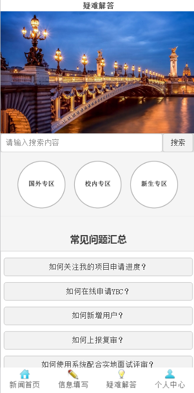
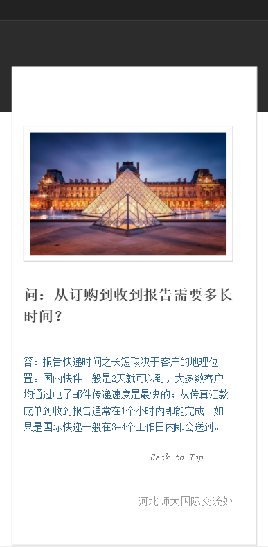
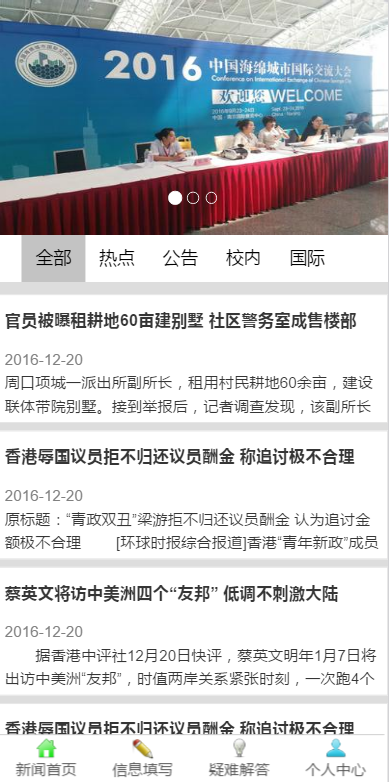
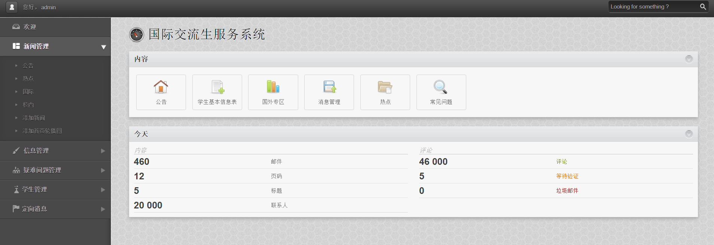

#基于微信的国际合作处服务系统

* [Github](https://github.com/GK782980788/-International-exchange-student-management-system-based-on-WeChat/graphs/contributors) 
* [HostedRedmine](http://www.hostedredmine.com/projects/a)

### 项目简介

**基于微信的河北师大国际处服务系统**是由六面魔方团队开发的，以宣传河北师大国际交流学院、方便国际处对学生和学生信息的收集、下达、管理为目的的系统。它依托于微信公众平台，无需安装特定APP，无需访问网页，方便学生随时查看。

“基于微信的河北师大国际处服务系统”分前台和后台两部分。前台部署到手机微信，实现了交流生们通过微信随时随地查看新闻，浏览消息，在线填报以及疑难问题查看等功能。后台依托于PC端，通过管理员账号登陆，实现对前台新闻、学生信息、疑难问题以及定向消息的添加、修改、删除等功能，方便管理员的管理。

该系统分为两期，一期将实现新闻的管理部分，浏览部分和学生管理部分，定向消息的管理部分，疑难问题查找与管理以及前后台的页面基础设计。二期我们将实现在线信息填报并自动生成文档，用户信息的获取与国际化处理，学生疑难论坛以及前台页面再美化等功能，以期使项目更加完美。

### 项目成员

* 郭可 (项目经理) 
    * Email: <0000@qq.com>
    * Github : 
* 岳雨萌 (开发工程师) 
    * Email: <0000@qq.com>
    * Github : 
* 张潇洁 (开发工程师) 
    * Email: <0000@qq.com>
    * Github : 
* 岳伟玺 (开发工程师) 
    * Email: <0000@qq.com>
    * Github : 
* 黄秀贞 (开发工程师) 
    * Email: <0000@qq.com>
    * Github : 
	
### 运行效果

