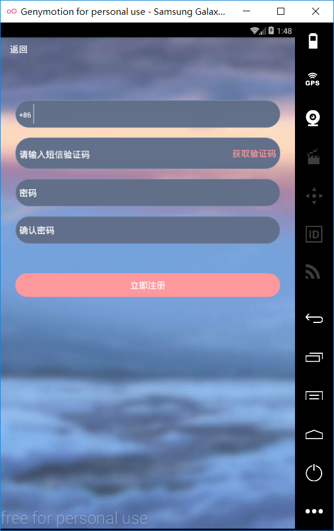
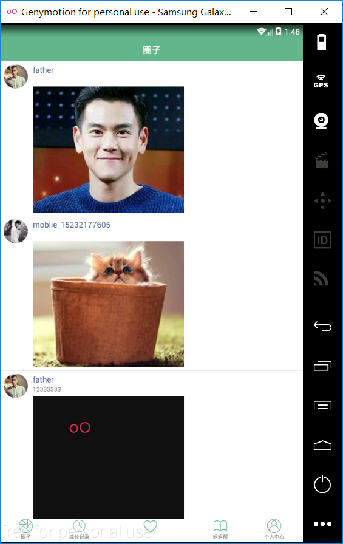
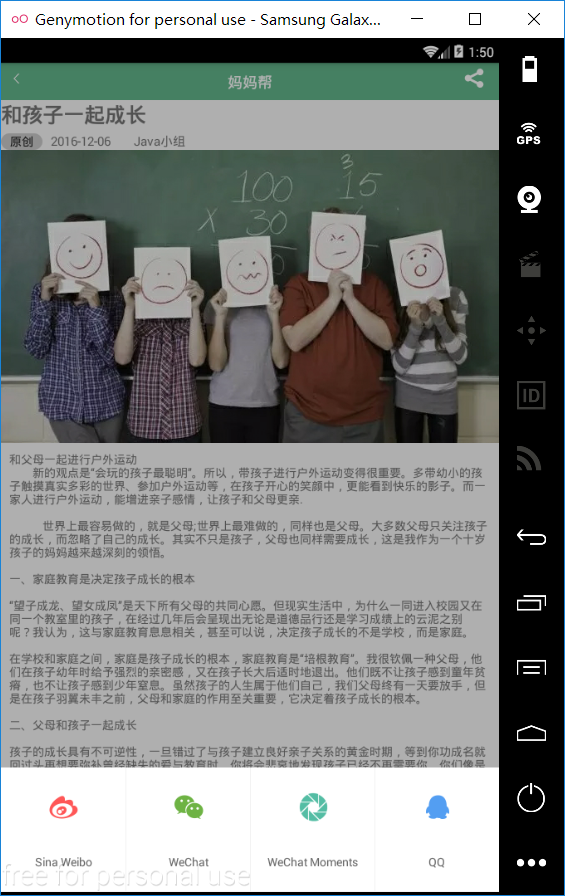
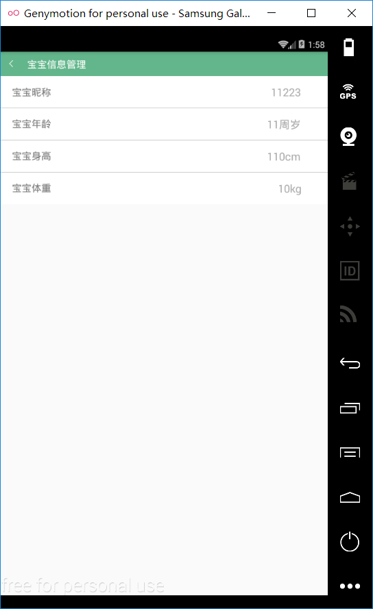
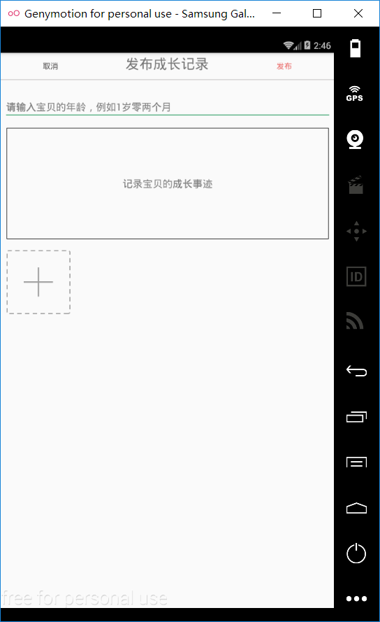

#宝宝成长树

* [Github](https://github.com/lizongyuyu/BabyGrowthRecord) 
* [HostedRedmine](http://www.hostedredmine.com/projects/baby_growth_record/wiki)

### 项目简介

**宝宝成长树**致力于在app中记录孩子生活的一点一滴，让父母在app中学到育儿知识，从app中更加贴近孩子的生活，了解他人父母的育儿之道！不时能够回顾自己孩子成长的历程，在回忆中增进与孩子之间的感情。

宝宝成长树此款软件目的就是利用手机来记录宝宝的每一天的发展，家长可以在软件内上传宝宝的每天的照片或视频，记录对孩子的期望，也可以在此款软件中记录着宝宝的一言一行。我们也可以将文件存储在云端。此款软件也可以让家长建立自己的朋友圈，来晒出自己家宝宝的点滴。利用互联网来记录孩子的成长。创新特点概述：

* 云存储 ：软件可以将关于孩子的文件存储在云端方便查看和避免丢失；
* 症状查询 ：软件中可以对一些儿童时期的小病症进行详细的描述,方便家长对自己孩子生病时自行检查；
* 圈子 ：家长可以在软件中进行自己家孩子和朋友家孩子的比较，在学习，体育，获奖等方面。

### 项目成员

* 李宗谕 (项目经理) 
    * Email: <375705792@qq.com>
    * Github : [https://github.com/lizongyuyu](https://github.com/lizongyuyu)
* 张斌 (测试工程师) 
    * Email: <925971874@qq.com>
    * Github : [https://github.com/zb925971874](https://github.com/zb925971874)
* 辛思奇 (产品经理) 
    * Email: <1535334482@qq.com>
    * Github : [https://github.com/xinsiqi](https://github.com/xinsiqi)
* 甄玉敏 (UI设计、开发工程师) 
    * Email: <319639390@qq.com>
    * Github : [https://github.com/zhenyumin](https://github.com/zhenyumin)
* 高杨 (开发工程师) 
    * Email: <502289380@qq.com>
    * Github : [https://github.com/gaoyangyangyang](https://github.com/gaoyangyangyang)

### 运行效果

