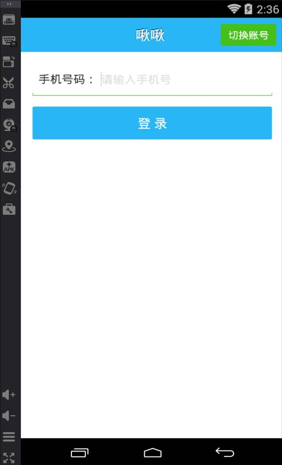
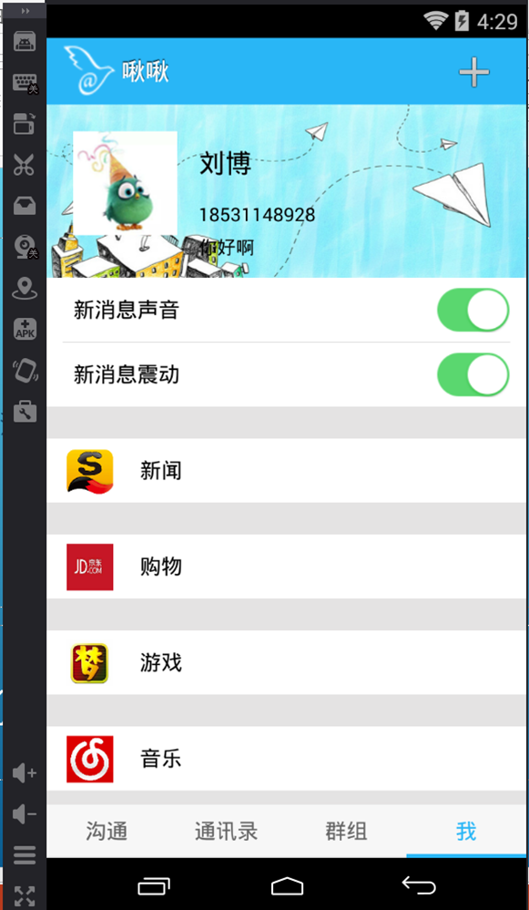
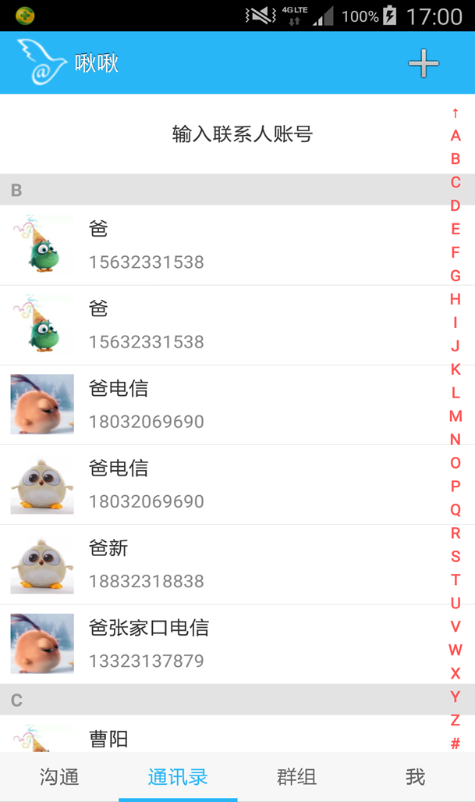
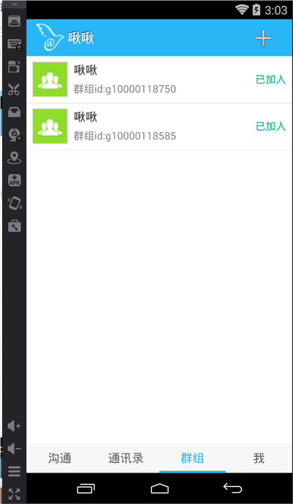
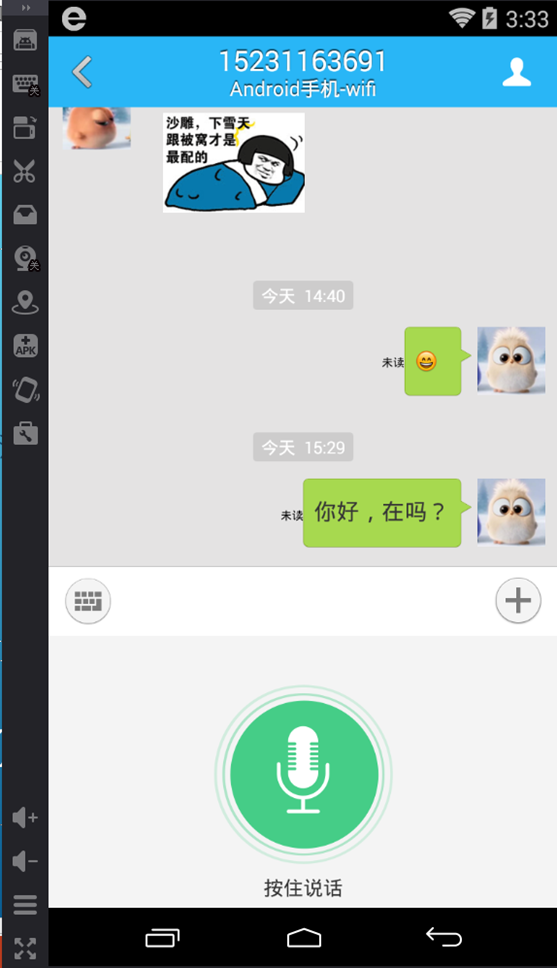
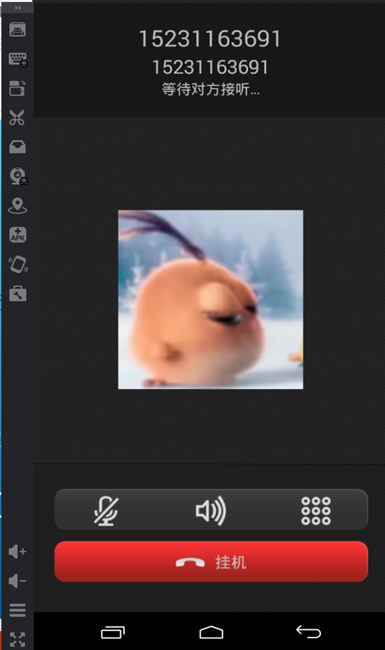
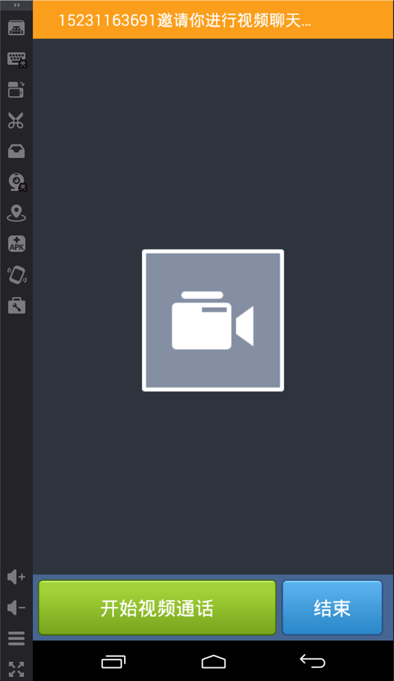
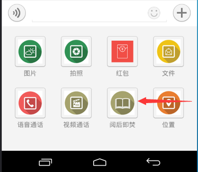

#实时聊天(啾啾)

* [Github](https://github.com/LixinCNN/jiujiu) 
* [HostedRedmine](http://www.hostedredmine.com/projects/java_communicate/wiki)

### 项目简介

**啾啾**，是一款基于手机本地通讯录的实时通讯软件，随着社会的发展，快捷在人们生活中已经越来越重要，所以，我们推出一款快速登录，快速通信的一款软件，来满足人们对快节奏生活的需求。

### 项目成员

* 李昕 (项目经理、开发工程师) 
    * Email: <454849455@qq.com>
    * Github : [https://github.com/LixinCNN](https://github.com/LixinCNN)
* 张佳明 (开发工程师)
    * Email: <411578999@qq.com>
    * Github : [https://github.com/2236631496](https://github.com/2236631496)
* 刘博 (UI设计、测试工程师)
    * Email: <525114757@qq.com>
    * Github : [https://github.com/androidboom](https://github.com/androidboom)
* 邢彦纳 (UI设计)
    * Email: <564692688@qq.com>
    * Github : [https://github.com/xingyanna](https://github.com/xingyanna)
* 刘振 (开发工程师)
    * Email: <838601458@q.com>
    * Github : [https://github.com/liuzhen001](https://github.com/liuzhen001)
* 李帅 (产品经理) 
    * Email: <1247611843@qq.com>
    * Github : [https://github.com/lishuai00](https://github.com/lishuai00)

### 运行效果

