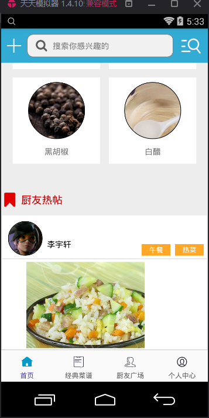
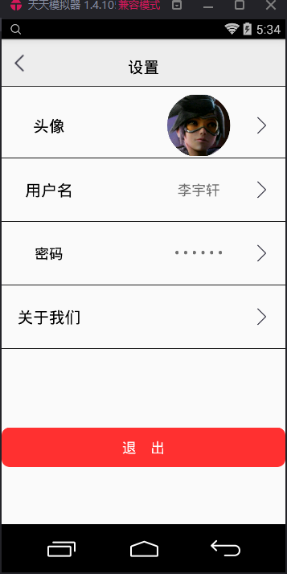

#小菜叨

* Github [客户端](https://github.com/zhangxin86/XiaoCaiDao) 
* Github [服务器端](https://github.com/byh0215/jinal_demo)
* [HostedRedmine](http://www.hostedredmine.com/projects/xiaocaidao/wiki)
* [界面原型](https://modao.cc/app/80e2fa0ec35d94eb86d0b7d43627a9858369076f)

### 项目简介

**小菜叨**是一款包含厨友交流、美食做法经验分享、菜谱搜索、厨友交流功能的app。

创意：

* 第三方数据接口与jFinal服务器的结合，基于第三方接口提供的大量数据以及jFinal服务器提供的用户交互数据，提供更为详尽，有效的数据。
* 论坛式交流，论坛式的发帖和评论体系与交流方式，提供给大家展示的天地。

### 项目成员

* 李宇轩 (项目经理) 
    * Email: <1070693672@qq.com>
    * Github : [https://github.com/liyuxuanAdoreLi](https://github.com/liyuxuanAdoreLi)
* 白悦辉 (产品经理、开发工程师) 
    * Email: <852924899@qq.com>
    * Github : [https://github.com/byh0215](https://github.com/byh0215)
* 	张鑫 (UI设计、开发工程师) 
    * Email: <759020938@qq.com>
    * Github : [https://github.com/zhangxin86](https://github.com/zhangxin86)	
* 	李兴 (开发工程师) 
    * Email: <365070122@qq.com>
    * Github : [https://github.com/lixing412](https://github.com/lixing412)	
* 贾紫璇 (测试工程师) 
    * Email: <627239053@qq.com>
    * Github : [https://github.com/iwithyou](https://github.com/iwithyou)	
* 梁航鸣 (开发工程师) 
    * Email: <634073858@qq.com>
    * Github : [https://github.com/lhmlol](https://github.com/lhmlol)	
* 刘昌龄 (开发工程师) 
    * Email: <happy995477826@qq.com>
    * Github : [https://github.com/liuchangling5](https://github.com/liuchangling5)	
	
### 运行效果

