#师大旅友团

* [Github](https://github.com/Traveler111/Gutenglong/tree/master/new3) 
* [HostedRedmine](http://www.hostedredmine.com/projects/first_blood/wiki)

### 项目简介

**师大旅友团**，如果河北师范大学的学生手机中能有一个旅友团的APP，在闲暇时间不想自己一个人去旅游可以借助本APP联系到有同样意向的同学，通过聊天功能商量并决定出游计划，这样将会带来极大的便利来创造一次完美的结伴游。

### 项目成员

* 李佳航 (项目经理) 
    * Email: <1191039404@qq.com>
    * Github : [https://github.com/jiahangLee](https://github.com/jiahangLee)
* 李金超 (产品经理) 
    * Email: <1184786618@qq.com>
    * Github : [https://github.com/lijinchao1](https://github.com/lijinchao1)
* 张志鑫 (开发工程师) 
    * Email: <1046044020@qq.com>
    * Github : [https://github.com/zhangzhixin997](https://github.com/zhangzhixin997)
* 古腾龙 (UI设计师) 
    * Email: <1145643778@qq.com>
    * Github : [https://github.com/Gutenglong](https://github.com/Gutenglong)
* 厚博宇 (测试工程师) 
    * Email: <994831619@qq.com>
    * Github : [https://github.com/houboyu	](https://github.com/houboyu	)	
	
### 运行效果

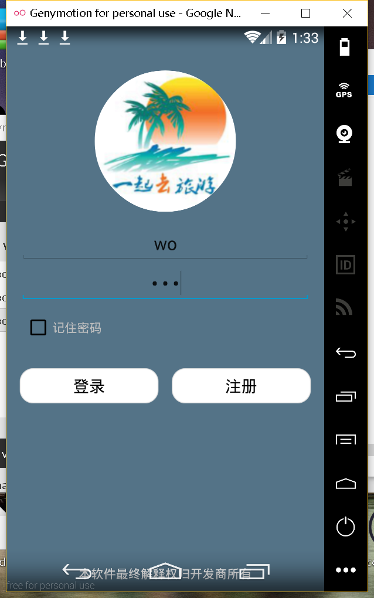

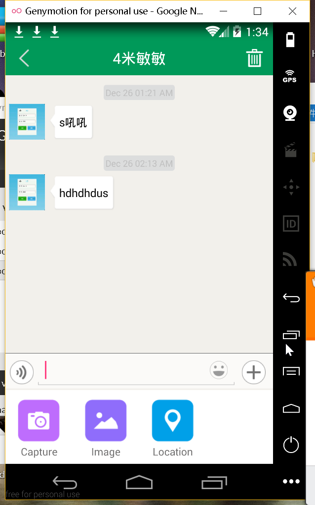
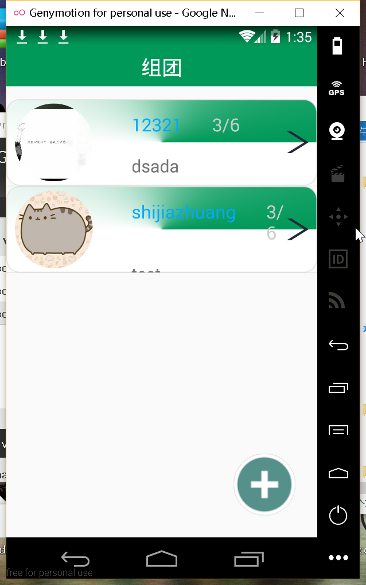
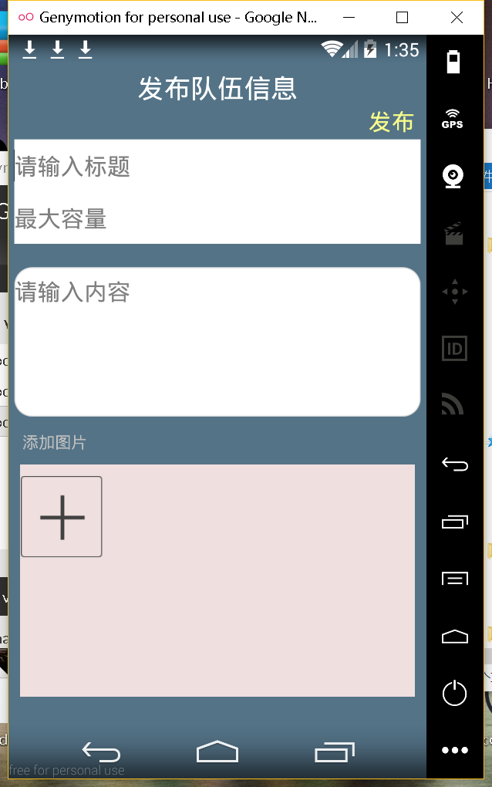

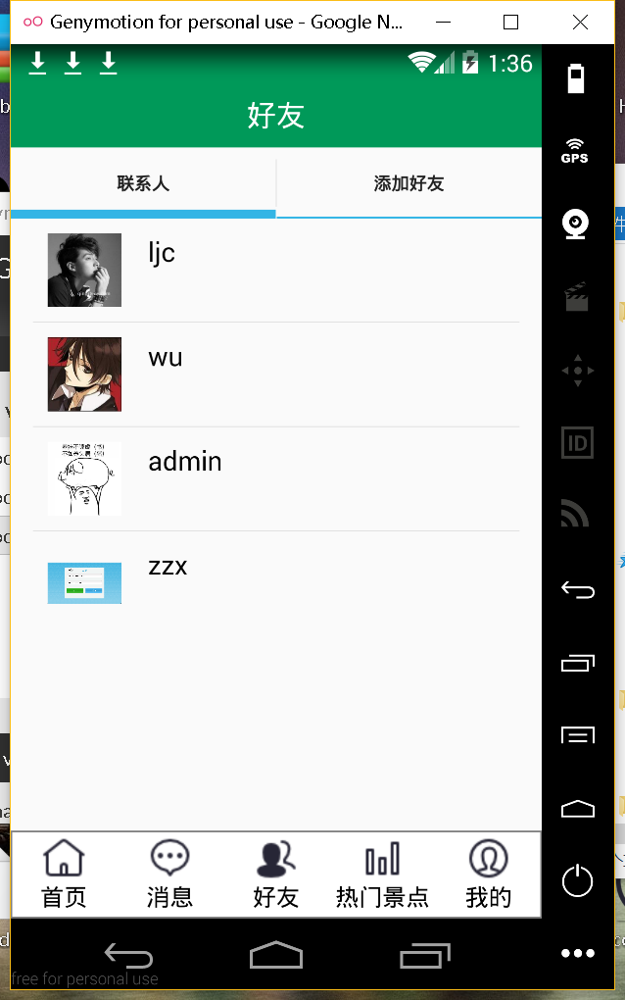

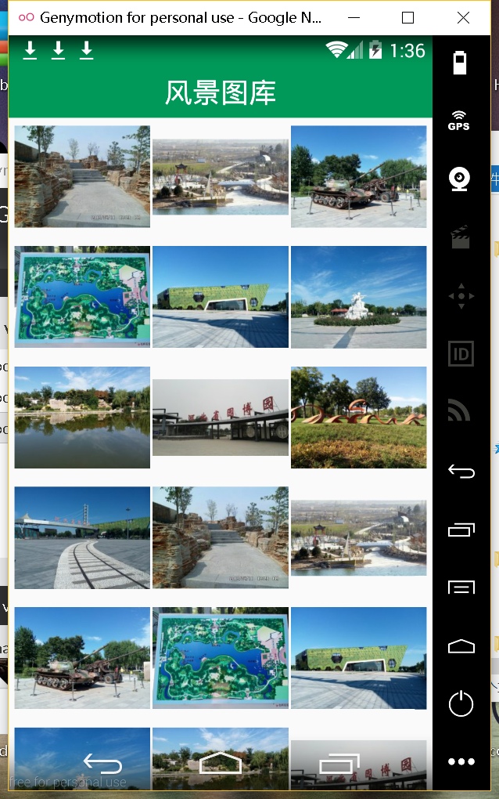

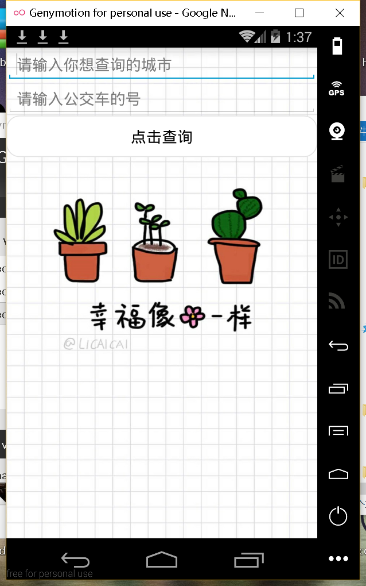

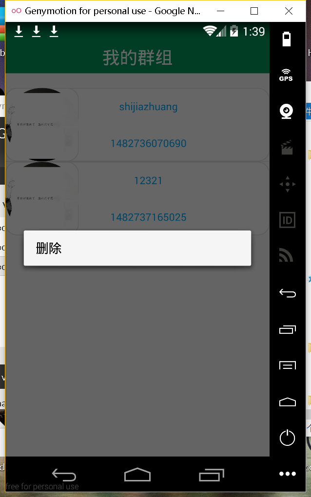

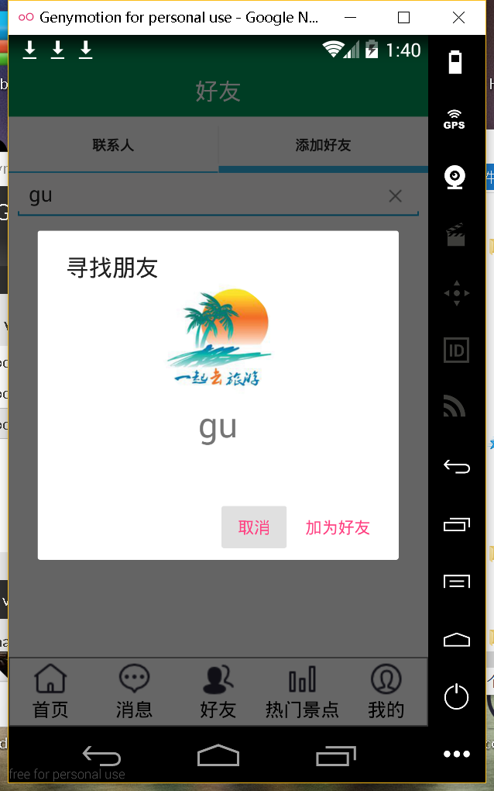
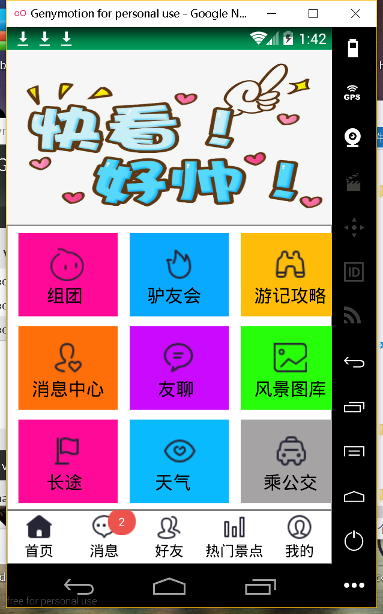
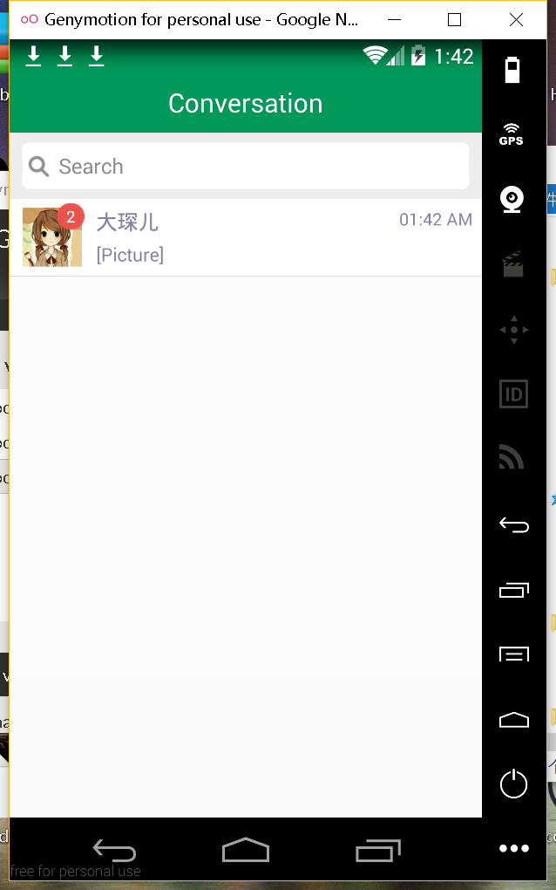

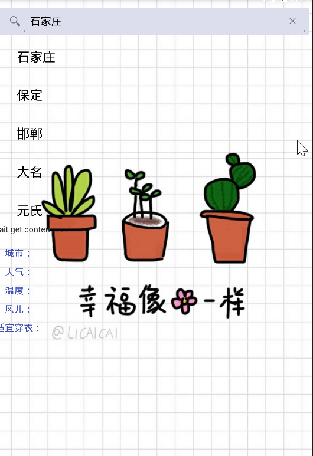