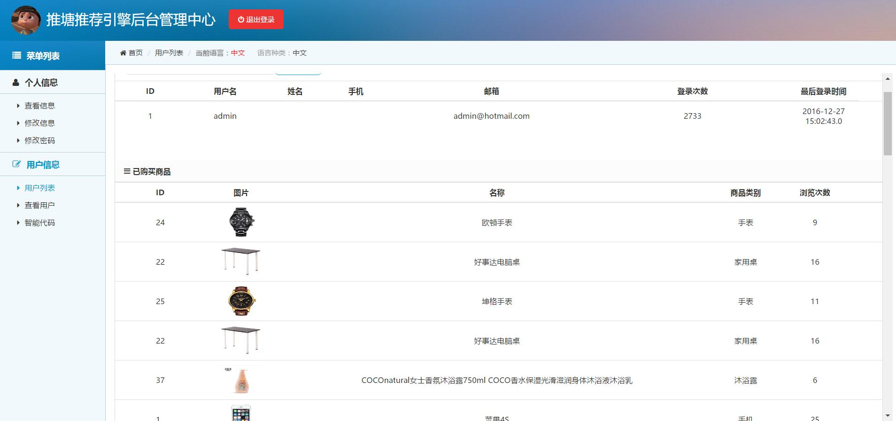
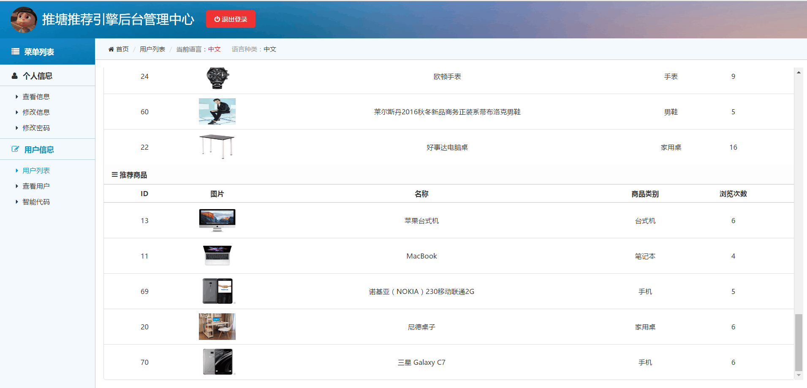
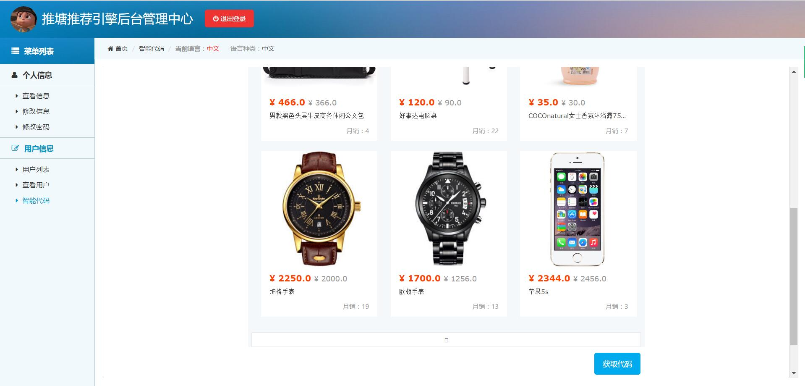
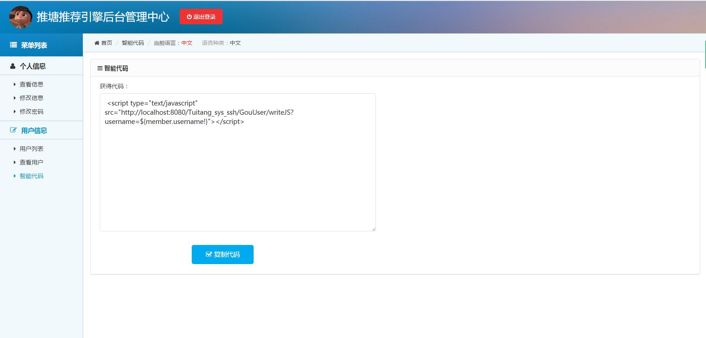

#推塘

* [Github](https://github.com/shenchenyang/Tuitang_ssh) 
* [HostedRedmine](http://www.hostedredmine.com/projects/qqq/wiki)

### 项目简介

**推塘**--一个个性化推荐平台，可以根据电商的用户数据，能在不经意间给用户推荐出他们可能喜欢的物品。可以大大提高用户的购买的效率，增加商家收入。是一个可以令电商平台更加人性化的推荐系统。

### 文件说明

	* ROOT:为我们的前台购物网，是不熟在TOMCAT上的
	* Tuitang_sys_ssh_最终结果:为目前我们整合的管理系统的源代码
	* jspgou-201612281030.sql：为我们整体用的数据库文件，包含购物网数据库和推荐系统数据库
	* QQQ_推塘推荐系统.zip：项目小组相关项目文档
	* Tuitang_sys_ssh.war：源代码的数据文件包，放在与ROOT同级目录下运行Tomcat服务器运行
    * 推塘购物网演示推塘后台调用方法用户介绍.docx：展示推荐系统功能的用户列表

### 使用说明

	* 将ROOT和Tuitang_sys_ssh.war部署在Tomcat服务器后，导入sql文件建立数据库，打开浏览器
	* 购物网地址：http://localhost:8080/
	* 购物网后台地址：http://localhost:8080/jeeadmin/jspgou/index.do
	* 推塘推荐系统地址：http://localhost:8080/Tuitang_sys_ssh/
	* 购物网的管理者账号: admin   密码；password
 	* 推塘推荐系统登陆用户：admin1	密码:123123
	
登陆购物网可对购物进行一系列操作，右侧有进入首页，首页的猜你喜欢只有在有用户登陆的情况下才会显示，右上角的兴趣调查也是，并且在任何时候都可进行用户的兴趣调查。购物网由于邮箱验证未实现，通过前台注册的用户无法登陆，可通过后台进行用户添加。在用户列表里点击实现协同过滤，再点击生成代码实现推荐物品数据的产生。

### 完成功能

通过一系列的推荐算法，能够根据用户的行为给用户推荐出适合他们的物品，暂时有三种推荐算法来实现功能：协同过滤算法，基于知识的推荐算法，基于行为的推荐算法。目的是为了提高用户的消费量和增加效率，从而减少商家的成本。

### 项目成员

* 房子毅 (项目经理) 
    * Email: <805659107@qq.com>
    * Github : [https://github.com/fangziyi0904](https://github.com/fangziyi0904)
* 沈晨阳 (产品经理) 
    * Email: <907693148@qq.com>
    * Github : [https://github.com/shenchenyang](https://github.com/shenchenyang)
* 孙婧涵 (开发工程师) 
    * Email: <sunjinghan2008@126.com>
    * Github : [https://github.com/sunjinghan](https://github.com/sunjinghan)
* 赵冬雪 (	测试工程师) 
    * Email: <153555384@qq.com>
    * Github : [https://github.com/zhaodongxue123](https://github.com/zhaodongxue123)
* 刘松 (开发工程师) 
    * Email: <1316167746@qq.com>
    * Github : [https://github.com/liusongear](https://github.com/liusongear)
* 李夺 (UI/开发工程师) 
    * Email: <842680544@qq.com>
    * Github : [https://github.com/liduo01](https://github.com/liduo01)
* 王子津 (测试工程师) 
    * Email: <623979874@qq.com>
    * Github : [https://github.com/wangzijin](https://github.com/wangzijin)

### 运行效果

