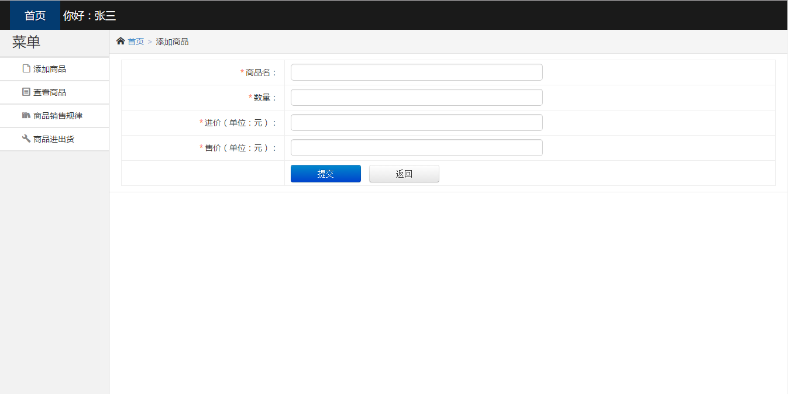
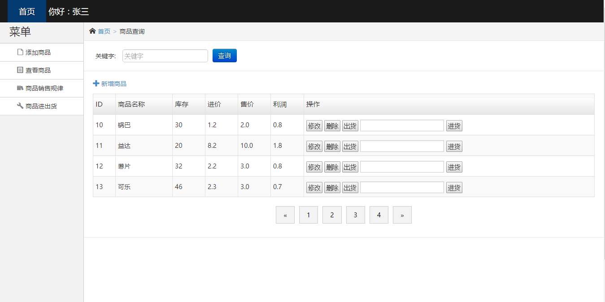
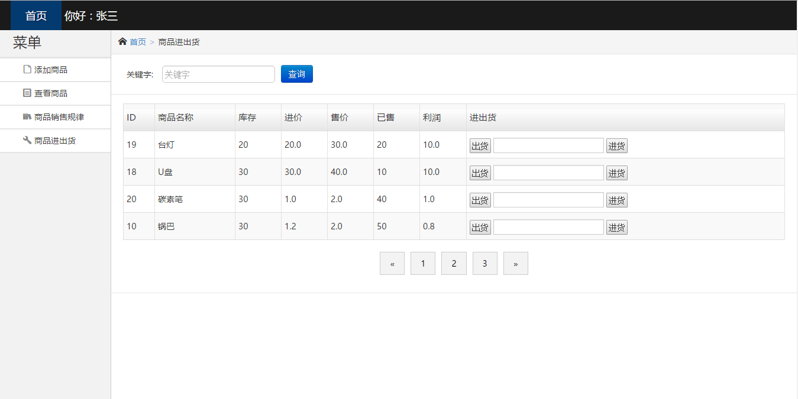

#校园超市商品管理系统

* [Github](https://github.com/wang987/-Supermarket-commodity-management) 
* [HostedRedmine](http://www.hostedredmine.com/projects/java_fivepeople)

### 项目简介

如今的校园超市已经逐渐遍及到我们的生活当中，但是大多数超市不能有效的管理每一种商品，盈利结算速度慢，容易出现营业差错，不宜进行商品调价，盘点效率底等。随着超市形态的高速发展，其经营管理也变的愈加复杂，日常所需处理的数据量也逐渐增大，商业运转的中间环节也越来越多，原始的人工管理已无法应对这复杂的市场。故结合现状开发一个**校园超市商品管理系统**，通过由校园超市管理员以比较低的价格租用该系统能更好的管理人力财力资源，在节约成本的同时还可以实现盈利，达到双赢的效果。

### 项目成员

* 王亚超 (项目经理) 
    * Email: <1449076200@qq.com>
    * Github : [https://github.com/wang987](https://github.com/wang987)
* 赵艺迪 (产品经理) 
    * Email: <896277001@qq.com>
    * Github : [https://github.com/bigtechbull](https://github.com/bigtechbull)
* 吴森 (开发工程师) 
    * Email: <2096706824@qq.com>
    * Github : [https://github.com/wuzhanzheng](https://github.com/wuzhanzheng)	
* 袁赞 (UI设计、开发工程师) 
    * Email: <279419653@qq.com>
    * Github : [https://github.com/yuanzzz](https://github.com/yuanzzz)	
* 康让 (测试工程师) 
    * Email: <582486382@qq.com>
    * Github : [https://github.com/kangrang](https://github.com/kangrang)	
	
### 运行效果

