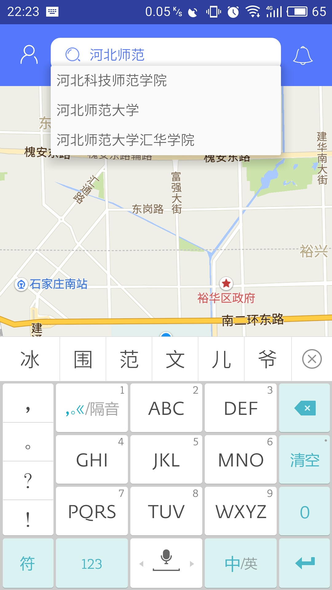

#校脸

* Github [客户端](https://github.com/yuanyin1995/FunOfSchool) 
* Github [服务器端](https://github.com/Aiome/XiaoLian-server)
* [HostedRedmine](http://www.hostedredmine.com/projects/school-face/wiki)
* [界面原型](https://modao.cc/app/4WEKaxYJR9pbfvdyXIej3vWI2iafRBg)

### 项目简介

**校脸**APP是一款高校间线上线下旅游交友软件。

用户可通过手机号与验证码注册，登陆后可进行的操作有：

* 修改个人资料
* 发送出游邀请并按条件匹配导游
* 接受或拒绝他人出游邀请
* 与他人实时聊天
* 查看地图景点覆盖物
* 记录出游路径
* 查看历史出游路径
* 发表对本次出游高校及导游的评价
* 查看他人对某高校或用户的评价
* 发表评价后刮刮乐抽奖
* 通过他人对自己的评价获得积分并兑换奖品

### 项目成员

* 袁音 (项目经理) 
    * Email: <13199980@qq.com>
    * Github : [https://github.com/yuanyin1995](https://github.com/yuanyin1995)
* 马红岩 (产品经理) 
    * Email: <420454139@qq.com>
    * Github : [https://github.com/Aiome](https://github.com/Aiome)
* 庄楠 (UI设计、开发工程师) 
    * Email: <405841911@qq.com>
    * Github : [https://github.com/tobewithMayday](https://github.com/tobewithMayday)
* 刘晔 (开发工程师) 
    * Email: <271737020@qq.com>
    * Github : [https://github.com/liuye326](https://github.com/liuye326)
* 王丹宇 (	测试工程师) 
    * Email: <791682021@qq.com>
    * Github : [https://github.com/wangdanyu](https://github.com/wangdanyu)
	
### 运行效果

