#河北师范大学试卷生成系统

* [Github](https://github.com/muxiangyumuxiangyu/Exhaust-volume.git) 
* [HostedRedmine](http://www.hostedredmine.com/projects/exhaustvolume/wiki)

### 项目背景

软件学院每学期的期末考试中使用的各种试卷都需要老师们手动制作，每一道试题都有难易等级之分，都需要老师们认真的筛选之后才能使用，包括后期的试题排版和试卷生成之后的命题分析等一些工作都是十分繁琐的。

### 项目介绍

该项目的目的就是为了减轻老师的工作量，基于河北师范大学软件学院的学科平台，创建一个有效合理的题库，在此基础上，帮助老师生成试卷和一些相关的文档。

### 项目范围

针对河北师范大学软件学院的学科平台，为河北师范大学软件学院的老师们提供服务。提供数字化的管理，提高学校试卷生成的工作效率。

###团队名

创意开发

### 项目成员

* 穆翔宇 (项目经理) 
    * Email: <602639320@qq.com>
    * Github : [https://github.com/muxiangyumuxiangyu](https://github.com/muxiangyumuxiangyu)
* 刘烨 (开发工程师) 
    * Email: <876540203@qq.com>
    * Github : [https://github.com/liuyeone](https://github.com/liuyeone)
* 王耀爽 (开发工程师) 
    * Email: <954168185@qq.com>
    * Github : [https://github.com/wangyaoshuang](https://github.com/wangyaoshuang)	
* 王广超 (开发工程师) 
    * Email: <1285351231@qq.com>
    * Github : [https://github.com/wangguangchaoone](https://github.com/wangguangchaoone)
* 李盈 (测试工程师) 
    * Email: <2292668286@qq.com>
    * Github : [https://github.com/liyingly](https://github.com/liyingly)	
* 郝建芬 (开发工程师) 
    * Email: <25438533@qq.com>
    * Github : [https://github.com/haojianfen](https://github.com/haojianfen)
	
### 生成文档示例

* [试卷](./下载文档示例/试卷.doc)	
* [试卷答案](./下载文档示例/试卷答案.doc)
* [命题明细表](./下载文档示例/命题明细表.xls)
* [课程考核命题与审题情况登记表](./下载文档示例/课程考核命题与审题情况登记表.doc)
	
### 运行效果
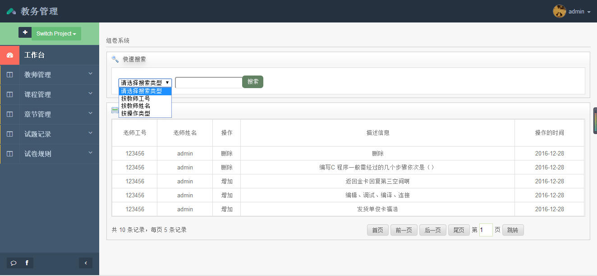
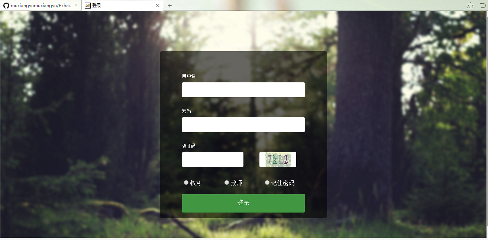
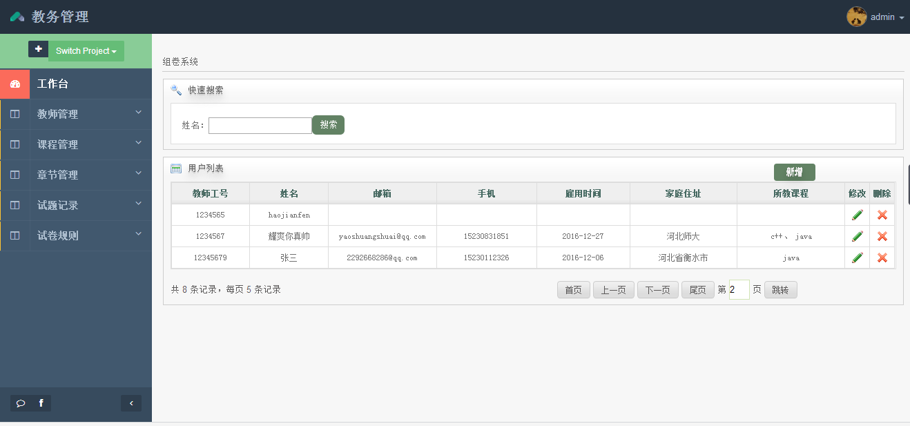

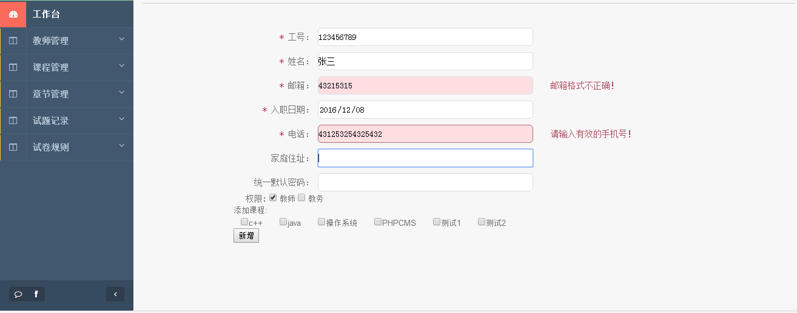
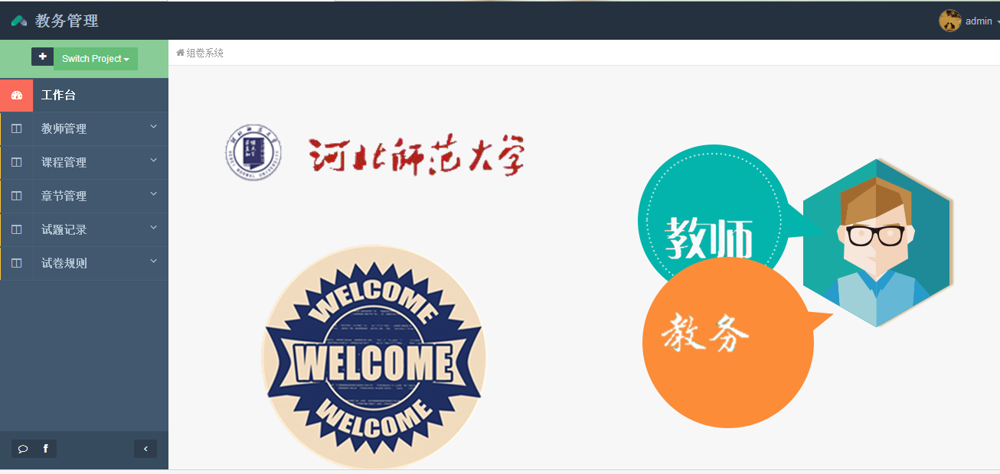
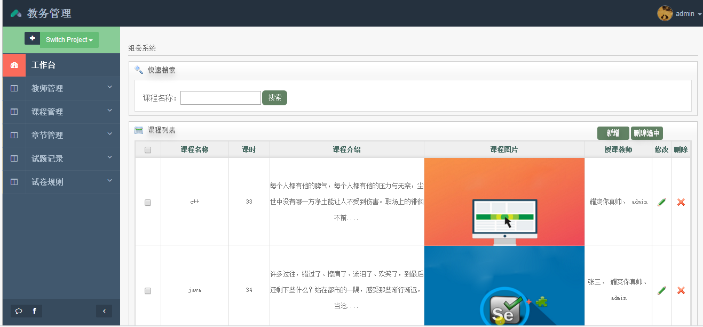

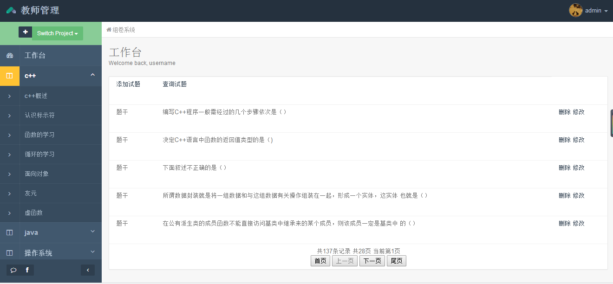
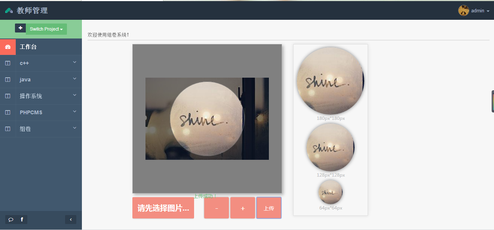

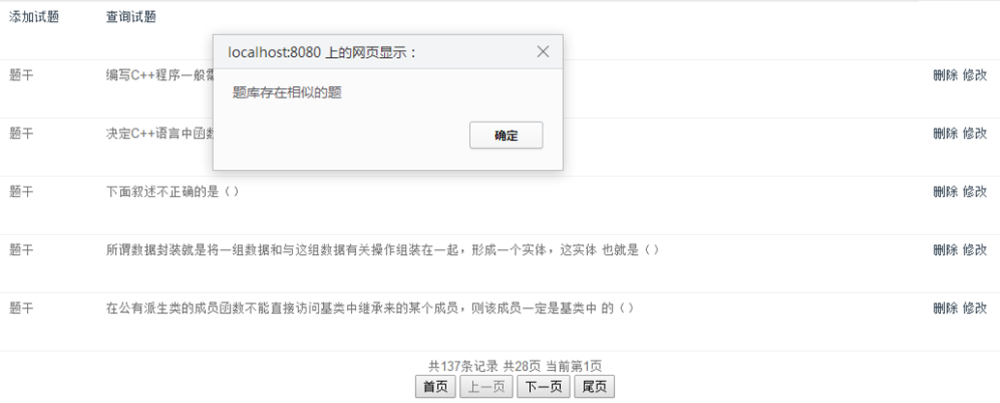
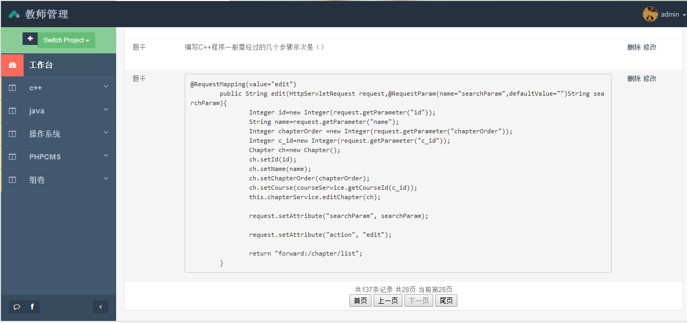
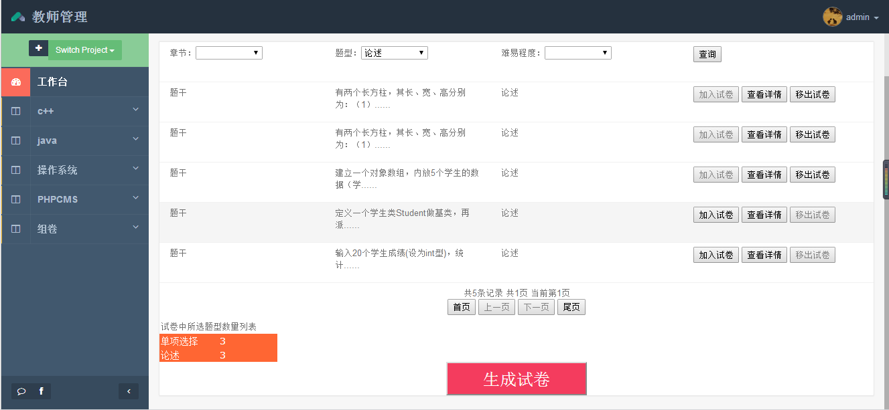

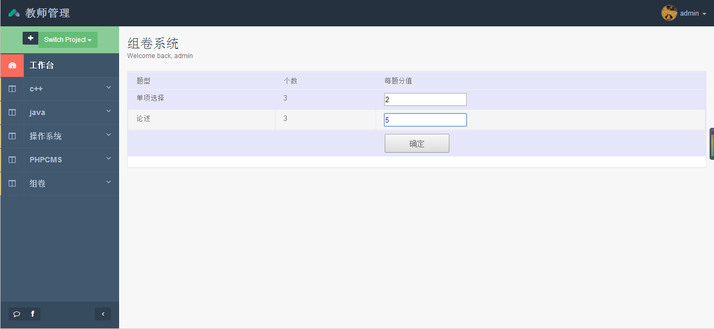
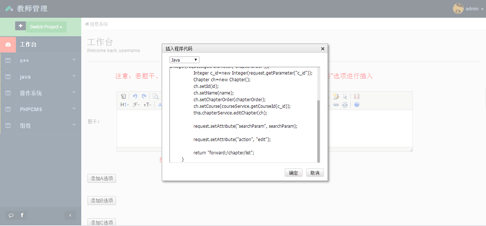
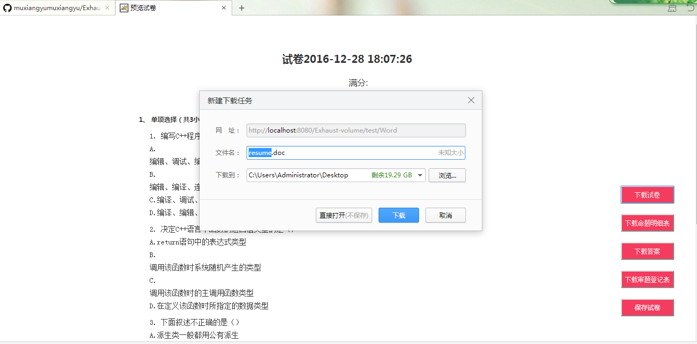

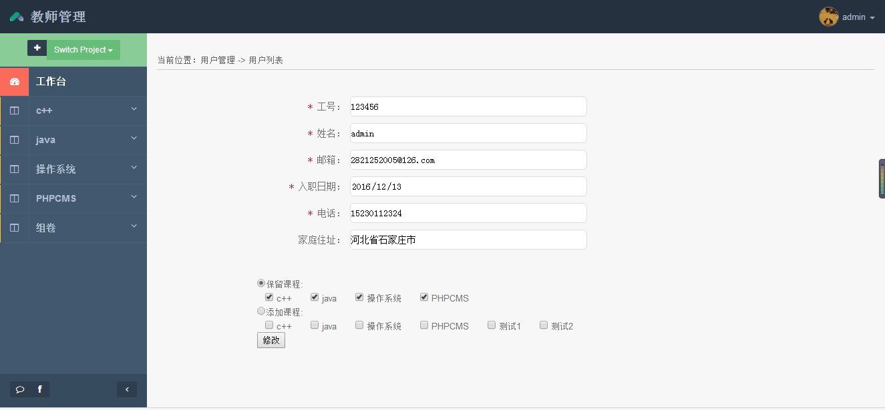
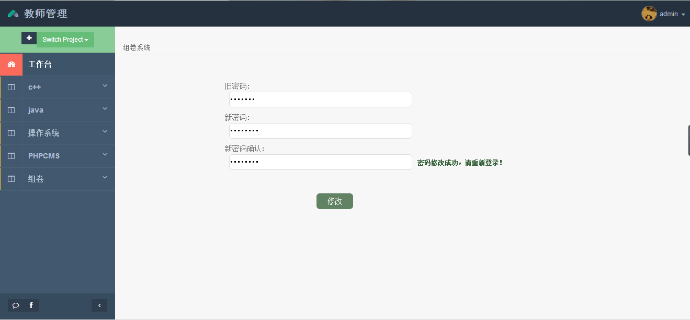
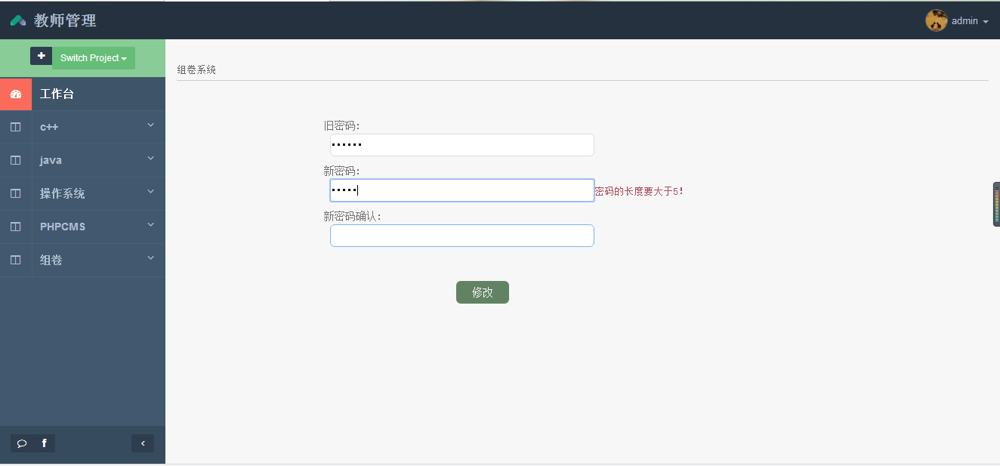

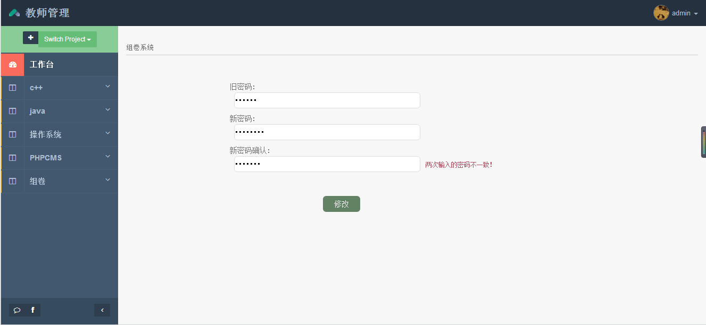
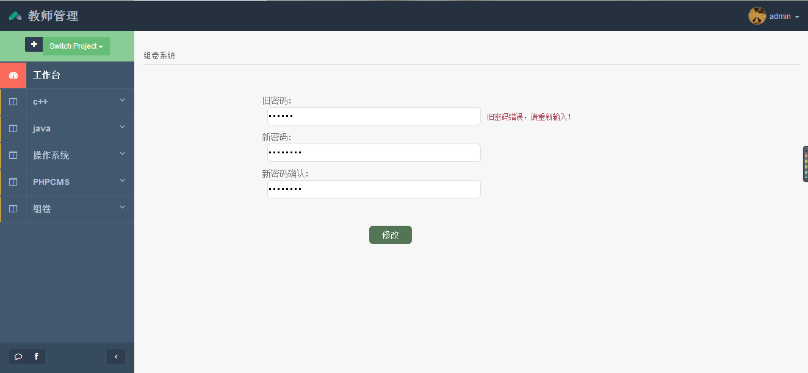

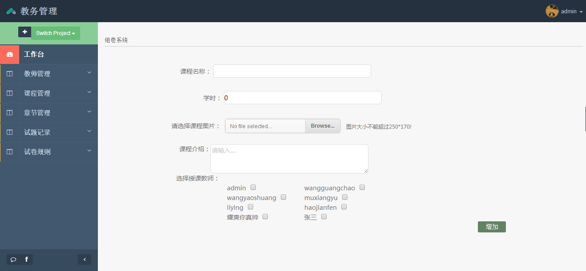
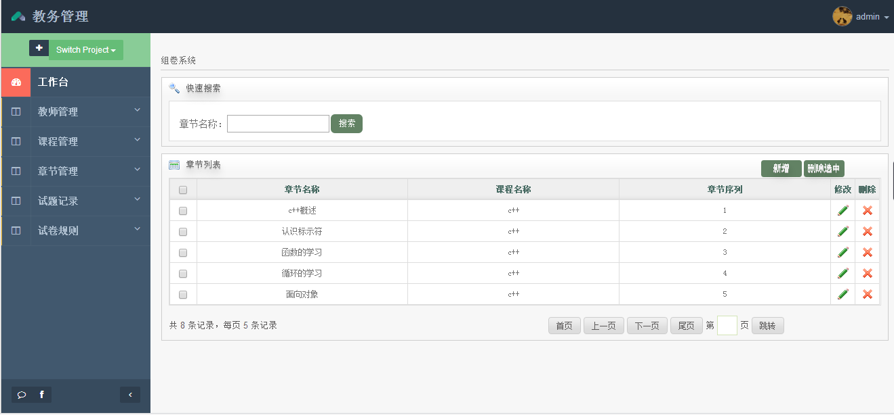

