#生活百事通

* [Github](https://github.com/PuShen/ConvenientLife) 
* [HostedRedmine](http://www.hostedredmine.com/projects/life_nothing/wiki)
* [界面原型](https://modao.cc/app/BLv0wMmyZQIkLIF9OBkWF23SJN1iHtv)

### 项目概述

生活百事通是一款生活查询类软件，致力于为您提供高质量的生活和出行服务，将用户生活中最常用的服务集结于一身，方便用户快捷、方便的浏览和查询，是出差、旅游的最佳伴侣。

### 功能介绍

* 天气预报：	能够为用户实时、准确的提供天气信息
    * 当天天气信息（主要是温度和天气）
    * 最近天气信息
    * 当天天气的详细信息（包括各类指标）
    * 当天的空气质量
    * 当天的生活指数
    * 城市的切换与保存
* 新闻头条：	为用户推荐实时的新闻事件
    * 提供实时的新闻热点
    * 新闻的分类切换
* 笑话大全：	为用户提供各种各样幽默的笑话
    * 各种幽默的趣闻笑话
    * 各种趣图笑话
* 全国公交及路线规划查询：方便用户查询各个城市的公交线路
    * 出门公交推荐
    * 公交线路查询
    * 站点经过车辆查询
    * 城市切换与保存
* 万年历：  	 日历方便用户查询日期
    * 提供给用户一个快捷方便的日历视图
    * 用户可以方便快捷的查看当天日历信息
* QQ号码测凶吉： 趣味功能，帮助用户娱乐
    * 提供给用户一个测试自己QQ号码吉凶的娱乐功能
* 微信精选：	推荐优秀的微信文章。
    * 提供给用户一些优秀的精选的微信文章，供用户阅读
* 周公解梦：解释各种梦的含义。
    * 帮助用户解释自己梦的详细信息

### 项目成员

* 王晓普 (项目经理) 
    * Email: <2876227630@qq.com>
    * Github : [https://github.com/PuShen](https://github.com/PuShen)
* 刘旭伟 (产品经理) 
    * Email: <972090394@qq.com>
    * Github : [https://github.com/liuxuwei](https://github.com/liuxuwei)
* 赵航 (UI设计、开发工程师) 
    * Email: <313283149@qq.com>
    * Github : [https://github.com/zhaohang95](https://github.com/zhaohang95)	
* 刘超 (开发工程师) 
    * Email: <1140053683@qq.com>
    * Github : [https://github.com/liuchao0837](https://github.com/liuchao0837)	
* 王旭 (开发工程师) 
    * Email: <1132669228@qq.com>
    * Github : [https://github.com/wangxu07](https://github.com/wangxu07)	
* 修坤朝 (开发工程师) 
    * Email: <460057710@qq.com>
    * Github : [https://github.com/xiukunchao](https://github.com/xiukunchao)	
* 陈熙 (开发工程师) 
    * Email: <272169660@qq.com>
    * Github : [https://github.com/chenxi1](https://github.com/chenxi1)
* 郭宏伟 (测试工程师) 
    * Email: <893509042@qq.com>
    * Github : [https://github.com/grang001](https://github.com/grang001)	
* 吴振杰 (开发工程师) 
    * Email: <632283554@qq.com>
    * Github : [https://github.com/dadaxixi](https://github.com/dadaxixi)	
	
### 运行效果

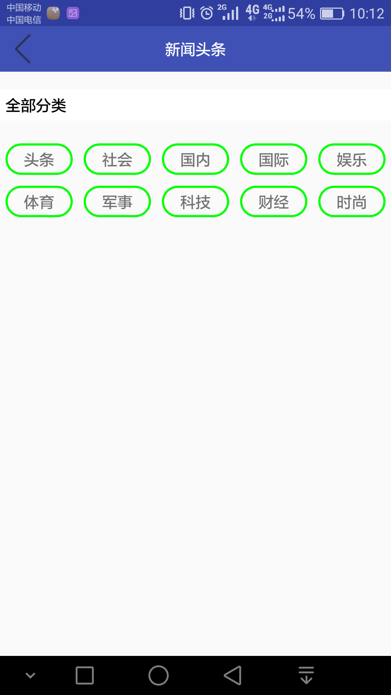

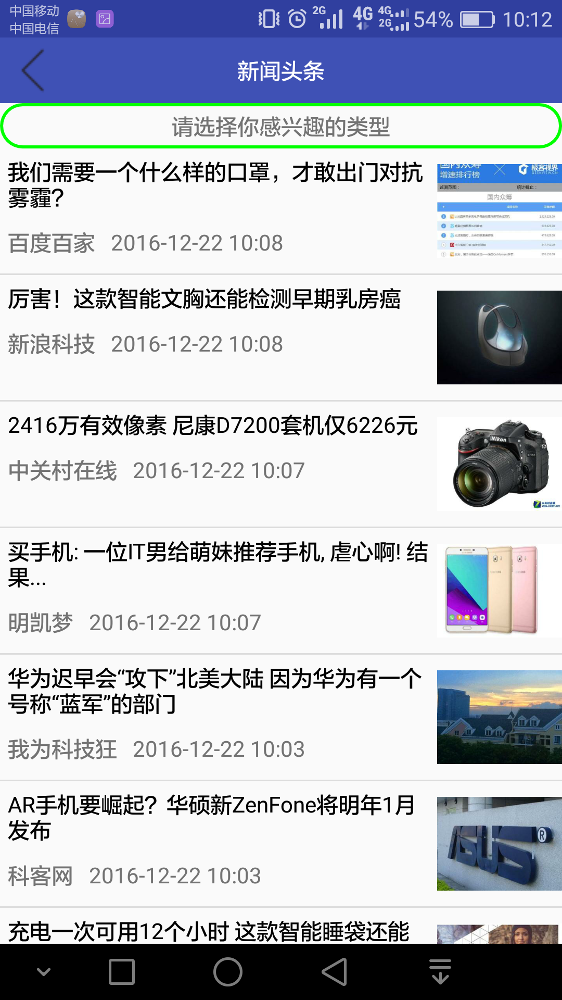

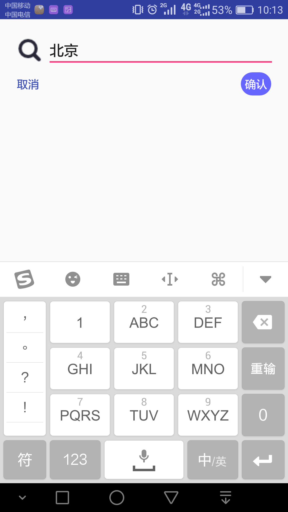
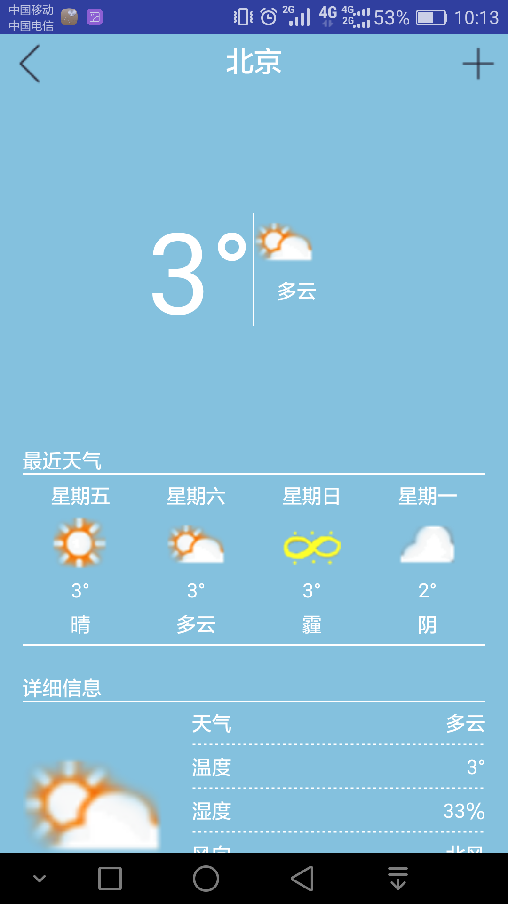

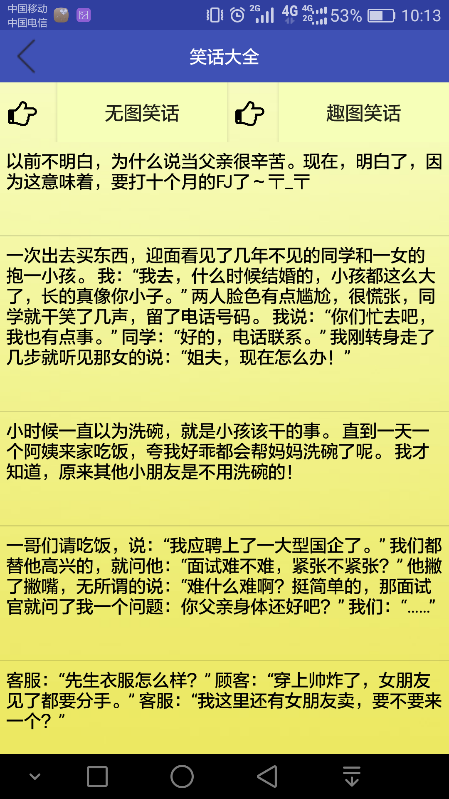
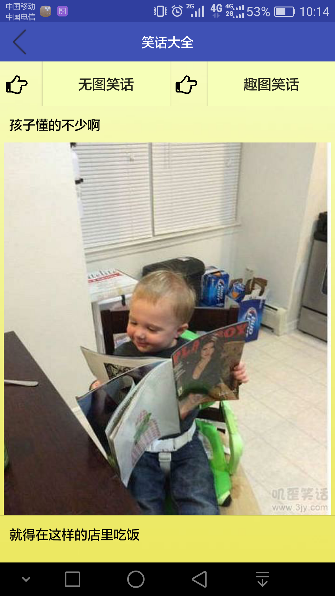
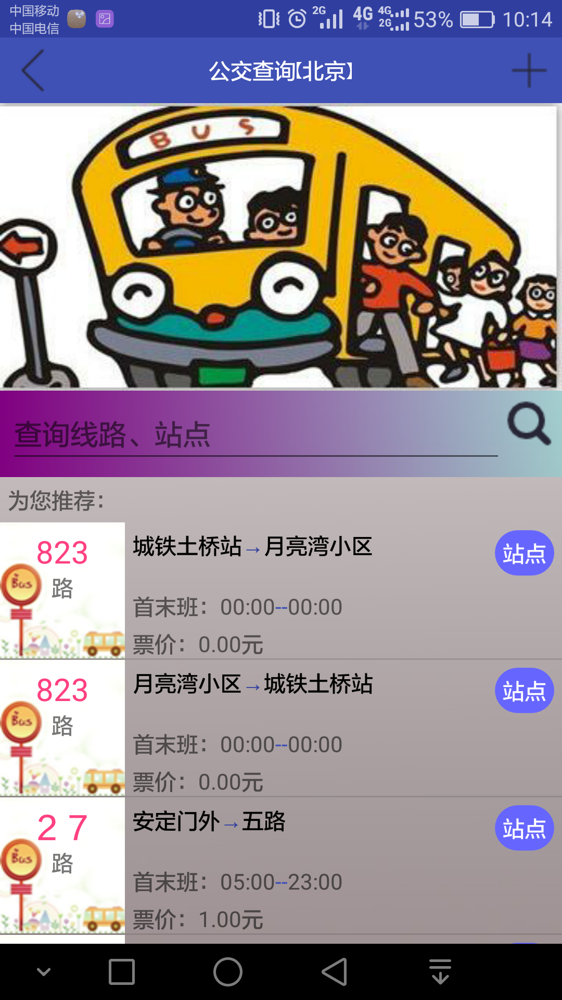

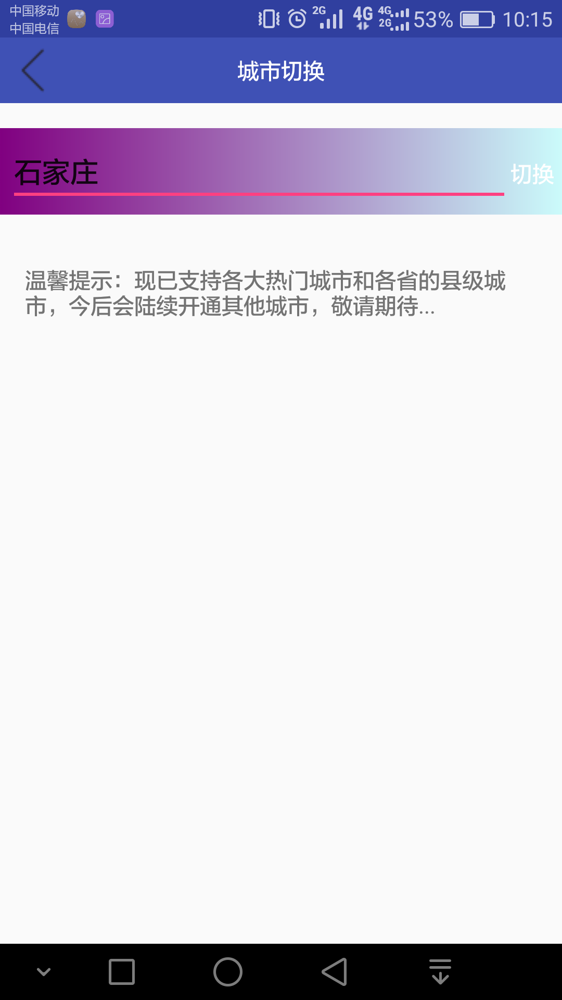
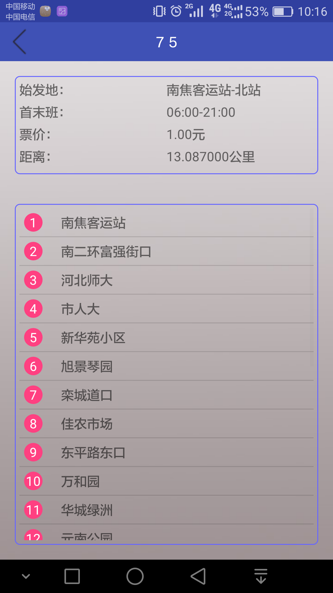
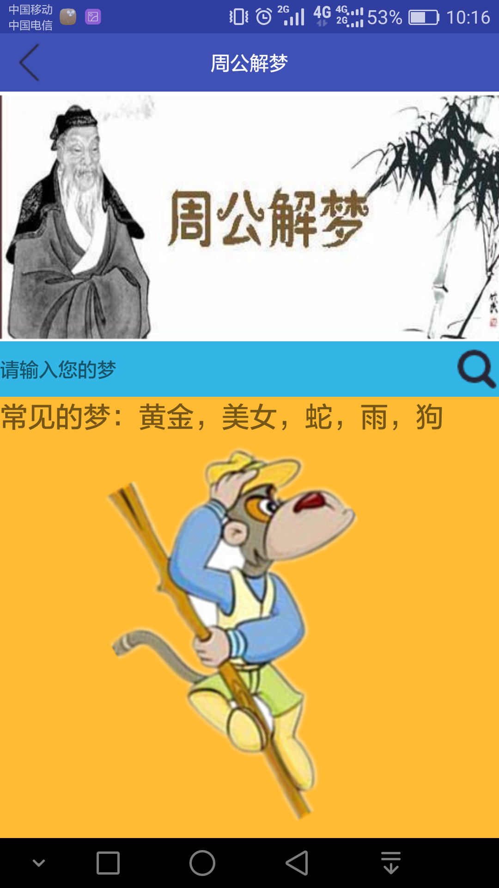

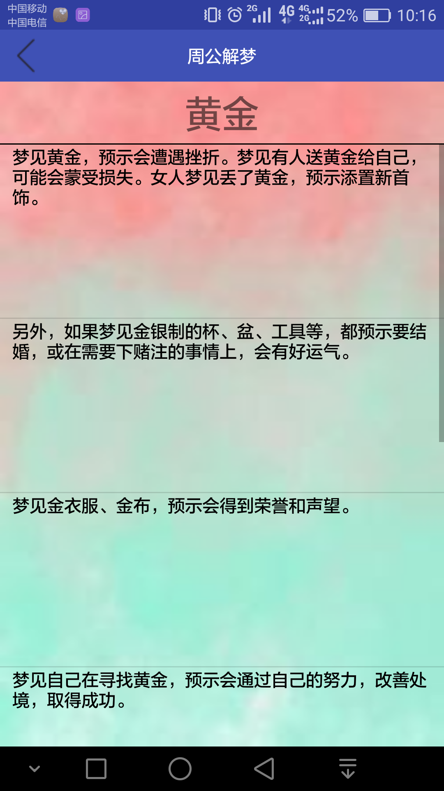
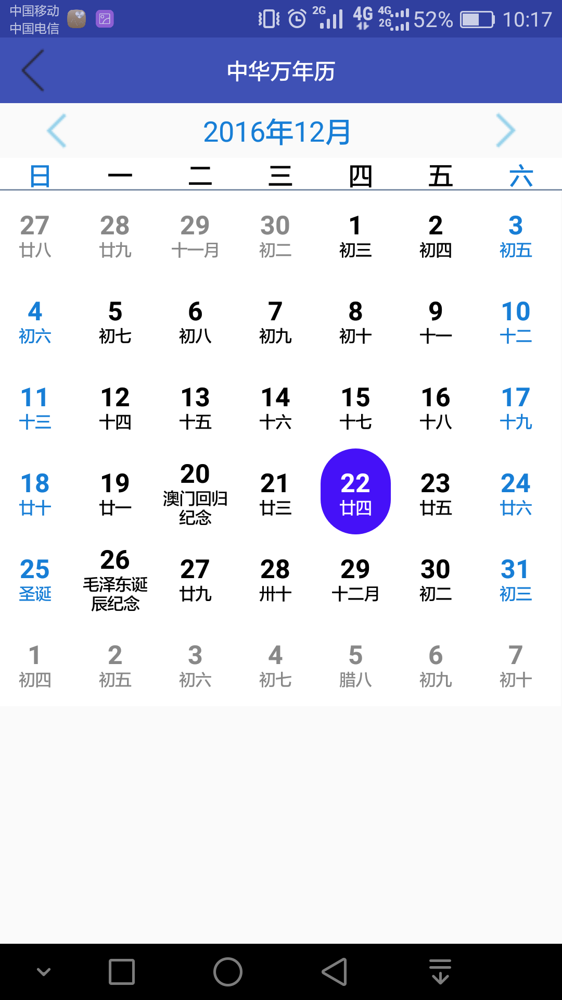
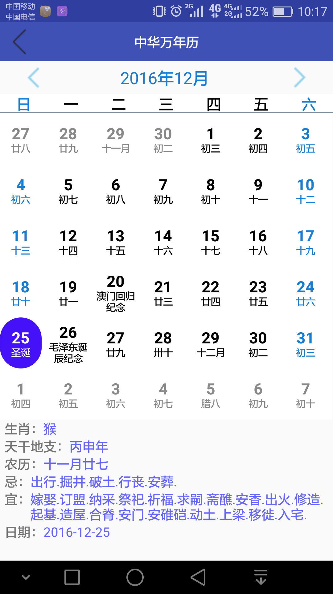

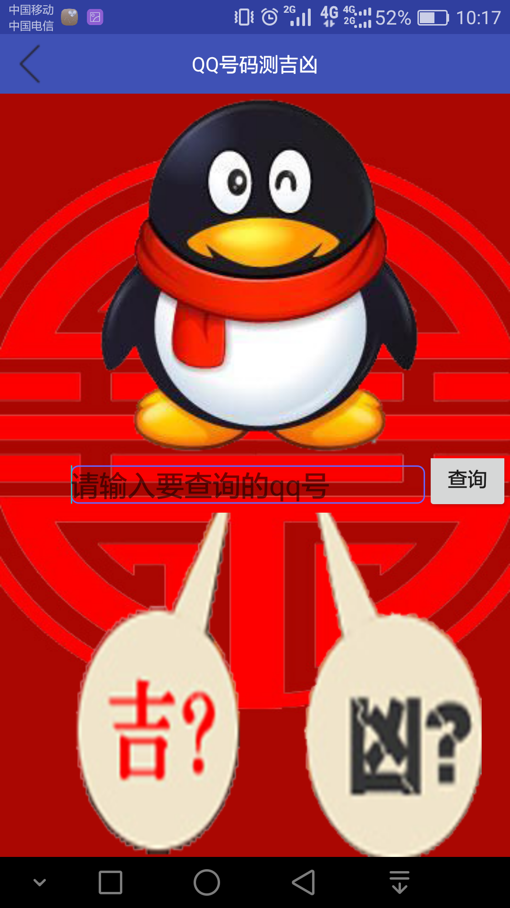
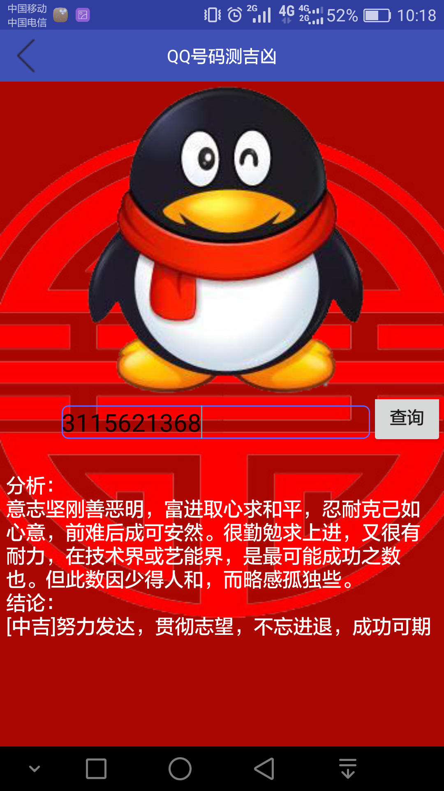