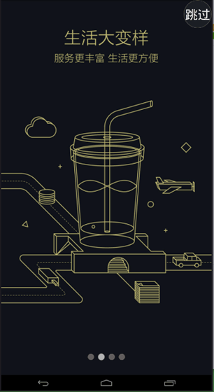
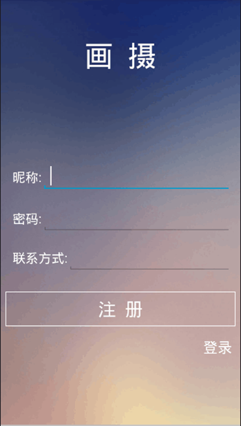
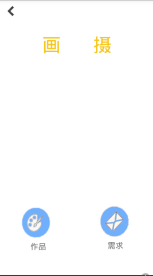
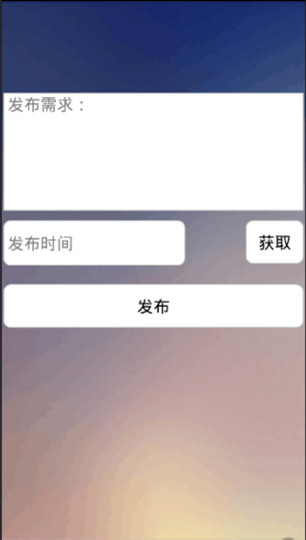
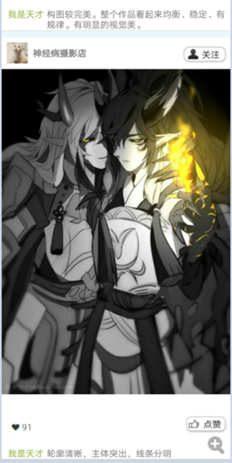
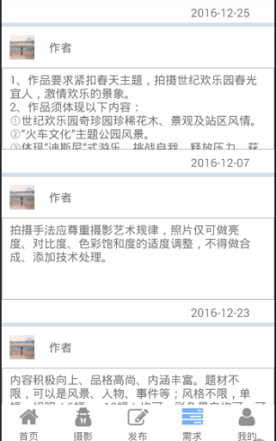

#画摄

* [Github](https://github.com/haodaxia1/MissPhoto.git) 
* [HostedRedmine](http://www.hostedredmine.com/projects/miss_photo/wiki)

### 项目简介

**画摄**是一款旨在提供一个便捷的画师和摄影师的约稿交易平台。 该系统完全舍弃传统且缺少管理和流程化的交易方式，甲方和乙方只需通过该约稿交易平台，可以直接相互联系，减少中介抽取大量中介费用现象的发生。画师和想要约稿的人均为本约稿交易平台的使用者。

### 项目范围

作品展示、 发布作品、 作品页面浏览（按人气排行）、 删除作品、 需求展示、 发布需求、 需求页面浏览（按稿费、截止日期排行）、 删除需求、 个人空间页面浏览、

### 项目成员

* 郝子琛 (项目经理) 
    * Email: <549787212@qq.com>
    * Github : [https://github.com/haodaxia1](https://github.com/haodaxia1)
* 张洪磊 (产品经理) 
    * Email: <1553035261@qq.com>
    * Github : [https://github.com/InterestDictatesHero](https://github.com/InterestDictatesHero)
* 安东 (UI设计、开发工程师) 
    * Email: <1142674378@qq.com>
    * Github : [https://github.com/DannyAnn](https://github.com/DannyAnn)	
* 张宇轩 (开发工程师) 
    * Email: <435433044@qq.com>
    * Github : [https://github.com/zhangyuxuan123](https://github.com/zhangyuxuan123)	
* 赵朔 (测试工程师) 
    * Email: <1135068324@qq.com>
    * Github : [https://github.com/zhaoshuo88](https://github.com/zhaoshuo88)	
* 闫中宇 (产品经理) 
    * Email: <763237139@qq.com>
    * Github : [https://github.com/yanzhongyu](https://github.com/yanzhongyu)	
* 张天艺 (UI设计、开发工程师) 
    * Email: <995004563@qq.com>
    * Github : [https://github.com/ichigoamin](https://github.com/ichigoamin)	
* 郑艺 (	开发工程师) 
    * Email: <710035886@qq.com>
    * Github : [https://github.com/Zy0214](https://github.com/Zy0214)	

### 运行效果

