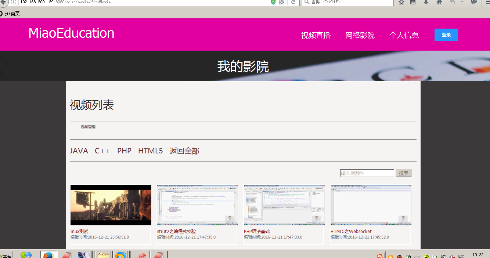
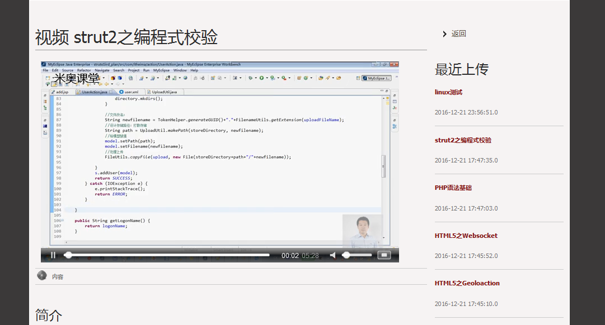
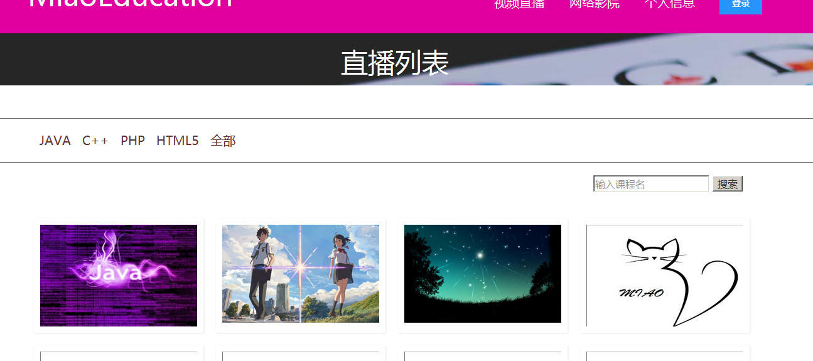

#米奥课堂

* [Github](https://github.com/m14o/miaoOnlineLiveStream) 
* [HostedRedmine](http://www.hostedredmine.com/projects/teamwin/wiki)

### 项目简介

在线课堂在实施教学点数字教育资源全覆盖，为了近一步帮助教学点开展课程，利用信息技术实现中心学校教师与教学点学生双向互动的一种常态化教学模式。

### 项目目的

实现老师与学生的双向互动，充分利用教学资源。

### 项目期望

在线课堂市场发展的势头将日渐高涨。而作为一个产品，作为一个教学系统，未来在线课堂的发展趋势，必然是具备全硬件、极简操作、强互动的特性。

### 项目成员

* 宋禹龙 (项目经理) 
    * Email: <907471325@qq.com>
    * Github : [https://github.com/a907471325](https://github.com/a907471325)
* 孙兰云 (开发工程师) 
    * Email: <1562110092@qq.com>
    * Github : [https://github.com/sly1995](https://github.com/sly1995)
* 程菊飞 (开发工程师) 
    * Email: <1946447909@qq.com>
    * Github : [https://github.com/chengjufei](https://github.com/chengjufei)	
* 曹家豪 (UI设计) 
    * Email: <867344781@qq.com>
    * Github : [https://github.com/caojiahao](https://github.com/caojiahao)
* 冯鑫 (开发工程师) 
    * Email: <601618233@qq.com>
    * Github : [https://github.com/fengxin8629](https://github.com/fengxin8629)
* 宋忠奇 (测试工程师) 
    * Email: <1078433882@qq.com>
    * Github : [https://github.com/songzhongqi](https://github.com/songzhongqi)
	
### 运行效果

