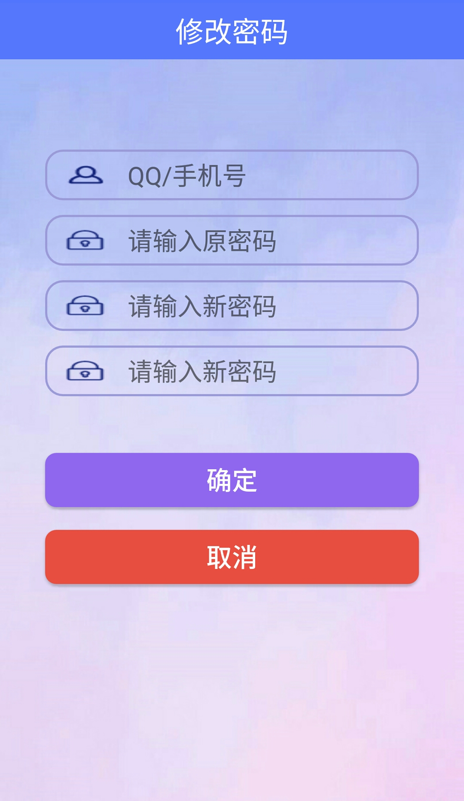
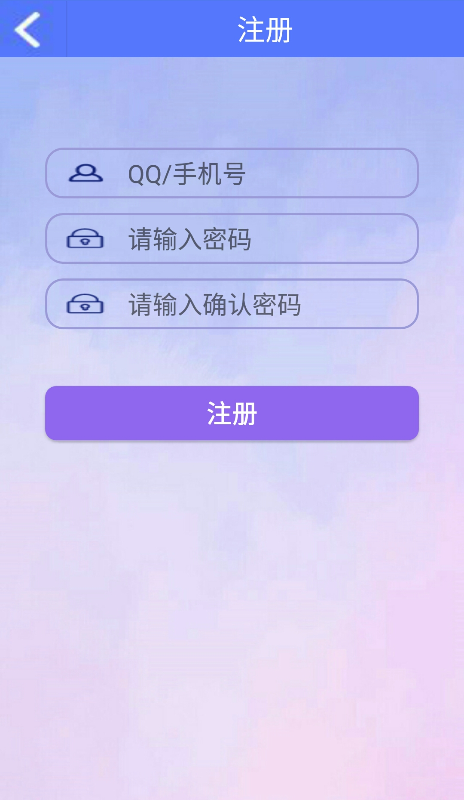
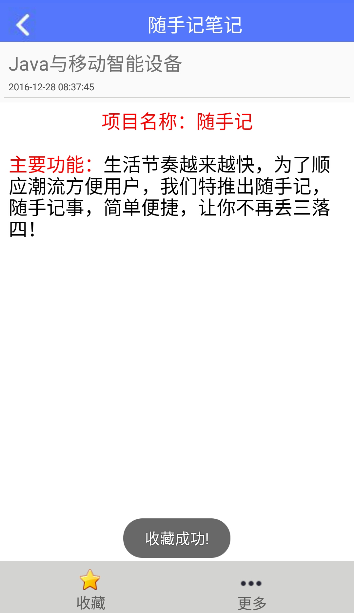
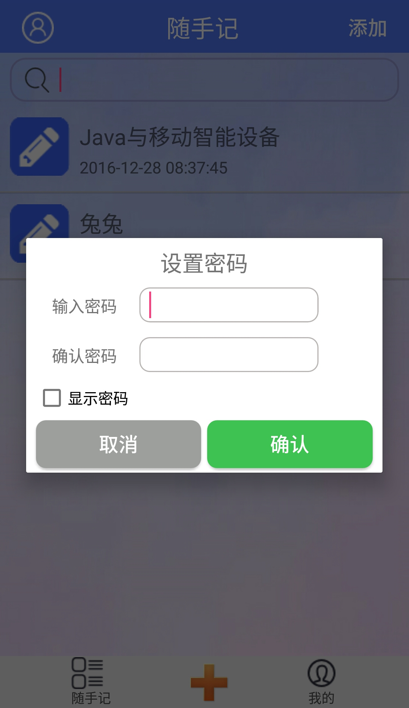
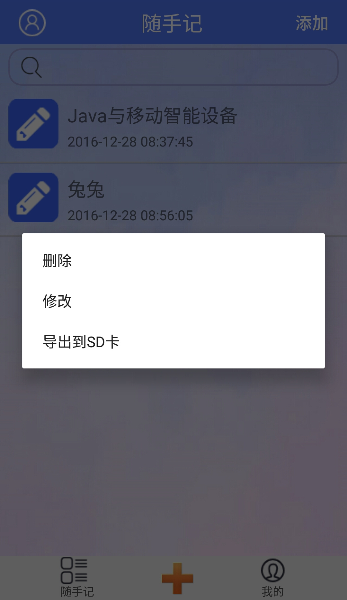
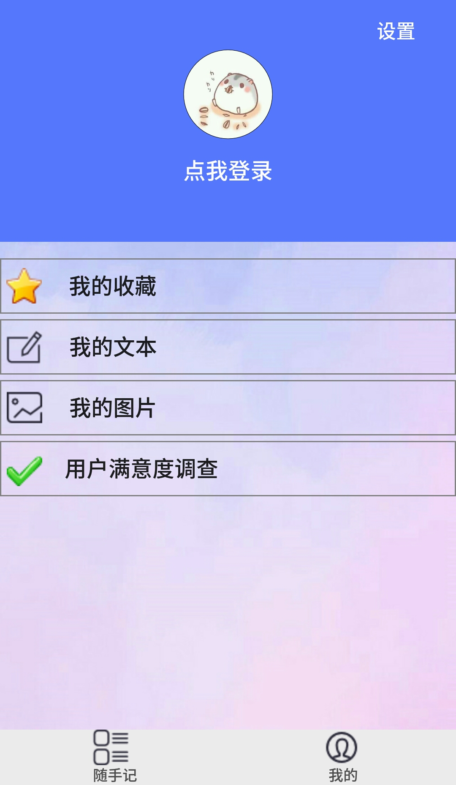
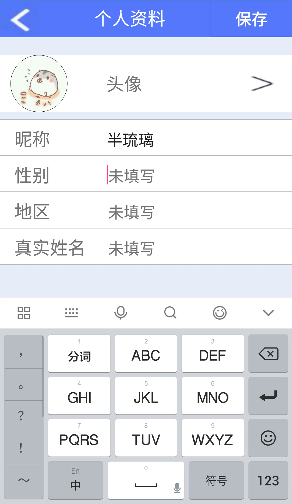
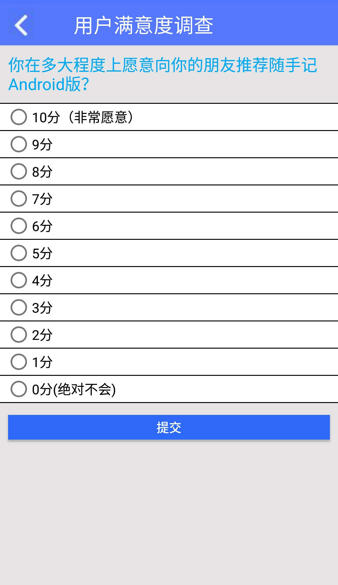
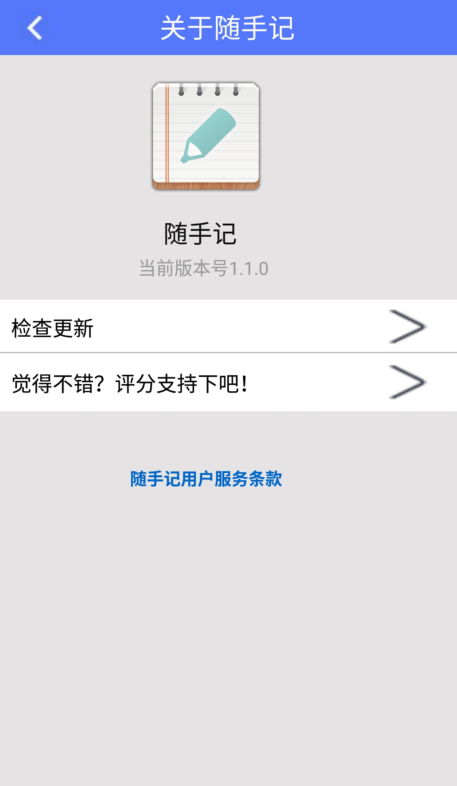
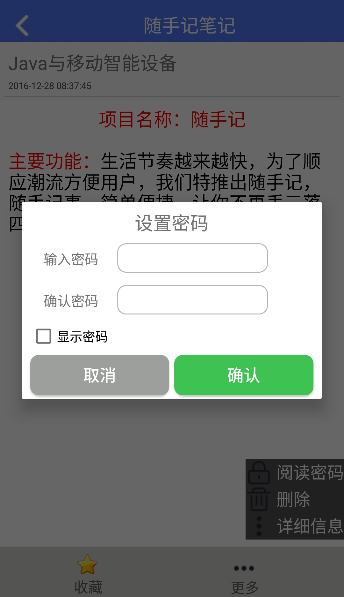

#随手记

* [Github](https://github.com/banliuli/GitDemo) 
* [HostedRedmine](http://www.hostedredmine.com/projects/java_cy1/wiki)

### 项目简介

生活节奏越来越快，为了顺应潮流方便用户，我们特推出**随手记**，随手记事，简单便捷，让你不再丢三落四！

### 项目成员

* 陈严 (项目经理) 
    * Email: <1342215280@qq.com>
    * Github : [https://github.com/banliuli](https://github.com/banliuli)
* 郝瑞 (产品经理) 
    * Email: <510866557@qq.com>
    * Github : [https://github.com/haorui123](https://github.com/haorui123)
* 张若羽 (UI设计) 
    * Email: <849030106@qq.com>
    * Github : [https://github.com/zhangruoyu414](https://github.com/zhangruoyu414)
* 王冉 (开发工程师) 
    * Email: <270824537@qq.com>
    * Github : [https://github.com/wangranrrr](https://github.com/wangranrrr)	
* 姜若雨 (测试工程师) 
    * Email: <2827168820@qq.com>
    * Github : [https://github.com/jry1995](https://github.com/jry1995)	
	
### 运行效果

