#食趣

* Github[Android端](https://github.com/tonghua97/Food) 
* Github[服务器端](https://github.com/tonghua97/BackGround)
* Redmine[HostedRedmine](http://www.hostedredmine.com/projects/food_fun/wiki)
* 原型设计[Android端](https://modao.cc/app/OfqmG1A9Nlss1GXQpTvgGy5rMLp5A23)
* 原型设计[服务器端](https://modao.cc/app/91kKNGOZ5nuUYwa2hMR8Wmk1NIUsZtk)

### 项目简介

**食趣**项目是一个可以让人们在不知道吃什么以及怎么做的时候，可以快速的进行查询的以得到自己想要的美食的APP。

本项目是集登录注册、美食的分类、查询以及推荐、排行榜、收藏等功能为一体，以查询美食为主要功能的一款多样化的APP。

* 推荐

我们会根据各个美食的营养价值，定期给用户推荐一些更好的美食。

* 拾趣
在人们享受美食的同时，还会有关于美食的文章以及趣闻的模块，让人们感受到美食的乐趣。

* 排行榜

更有将美食收藏数量较多的美食进行排序的显示，以供用户选择。

* 分类

我们将美食进行了分类，主要分为三大类，以及每一个大类里面的小分类，可以让用户进行有目的性的选择自己想要的美食。

* 登录和注册

在个人中心页面我们有登录注册的功能，以便于让用户感受到自己是独立存在的个体。

* 收藏

我们可以对自己感兴趣的美食以及拾趣进行收藏，以及可以在用户的个人中心页面对所有收藏过的进行查看。

* 个人信息的设置

可以对用户的个人信息，包括头像昵称等信息进行修改。

* 搜索

我们在保留原有搜索框的基础之上，将搜索分为三种智能搜索，即名称搜索，食材搜索以及时间搜索，每一种搜索都对应着不同的页面，以便让用户进行快速的进行选择。

### 项目成员

* 王瑞梅 (项目经理、开发工程师) 
    * Email: <2117732618@qq.com>
    * Github : [https://github.com/tonghua97](https://github.com/tonghua97)
* 姜佳妮 (UI设计、开发工程师) 
    * Email: <951329327@qq.com>
    * Github : [https://github.com/jiangjiani](https://github.com/jiangjiani)
* 刘博园 (开发工程师、测试工程师) 
    * Email: <542567635@qq.com>
    * Github : [https://github.com/JingJerr](https://github.com/JingJerr)	
* 郑岚馨 (开发工程师) 
    * Email: <853231205@qq.com>
    * Github : [https://github.com/zhenglanxin](https://github.com/zhenglanxin)	
* 王晨阳 (	UI设计、开发工程师) 
    * Email: <1961542078@qq.com>
    * Github : [https://github.com/nabyss](https://github.com/nabyss)	
* 李曼 (产品经理、开发工程师) 
    * Email: <1349612036@qq.com>
    * Github : [https://github.com/limanll](https://github.com/limanll)	
* 韩梁爽 (开发工程师) 
    * Email: <hanliangshuang123@163.com>
    * Github : [https://github.com/hanliangshuang](https://github.com/hanliangshuang)	
* 李静 (开发工程师、测试工程师) 
    * Email: <1098199363@qq.com>
    * Github : [https://github.com/201403lijing](https://github.com/201403lijing)	

### 运行效果

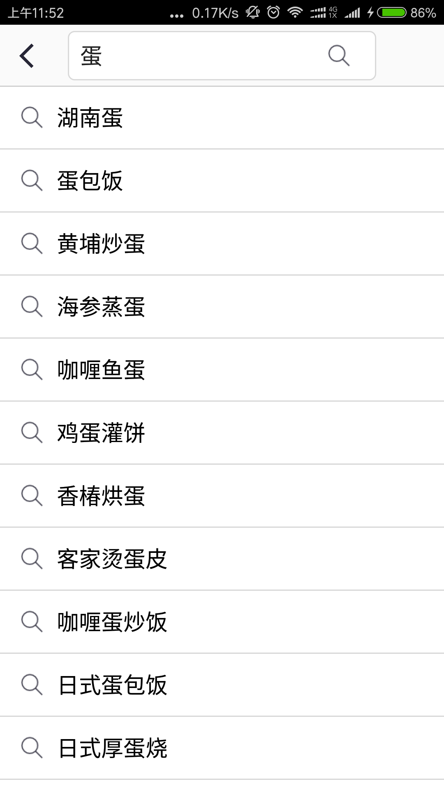

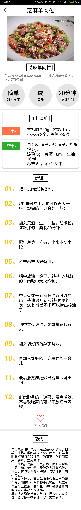

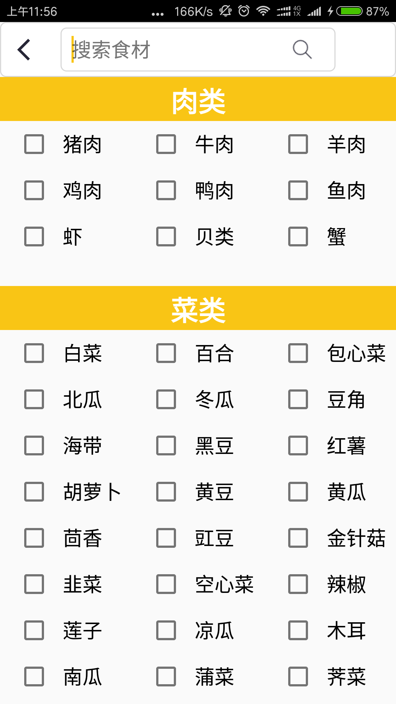
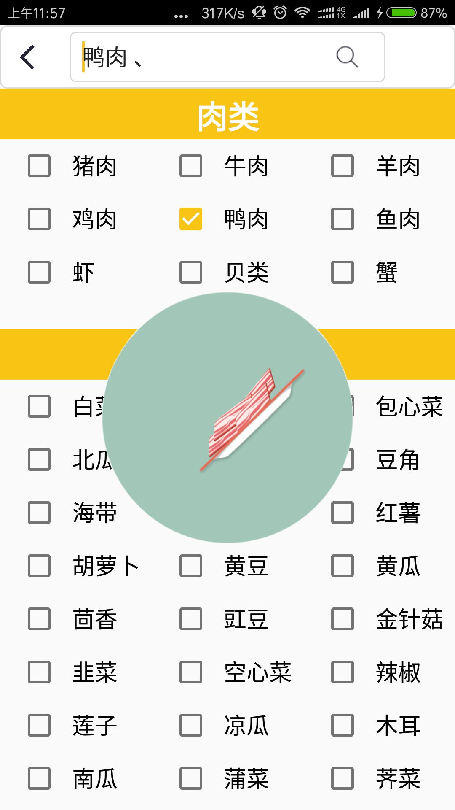
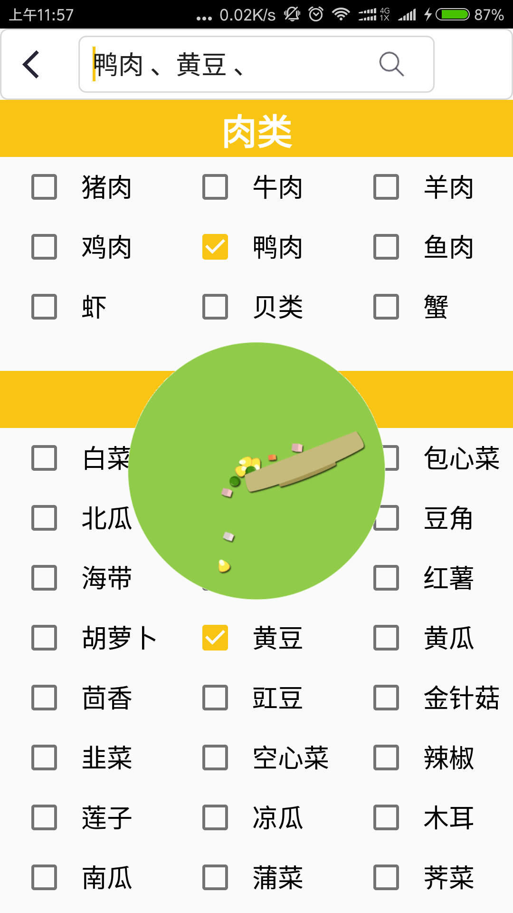

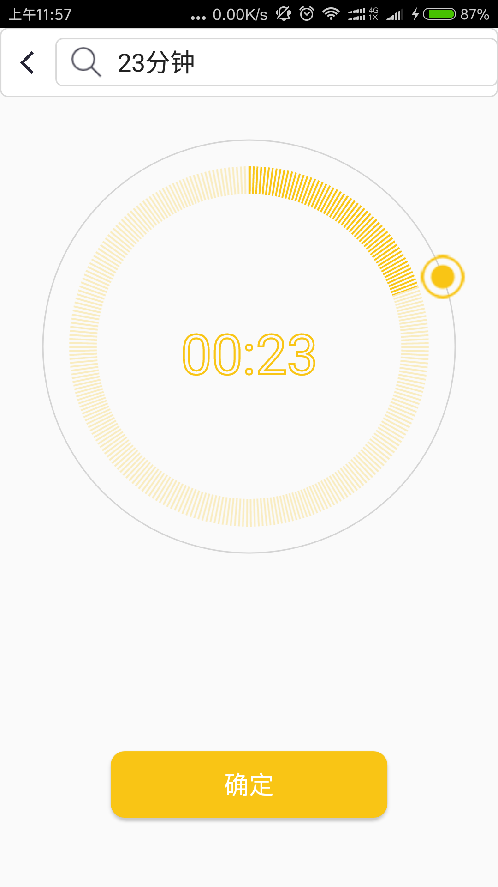
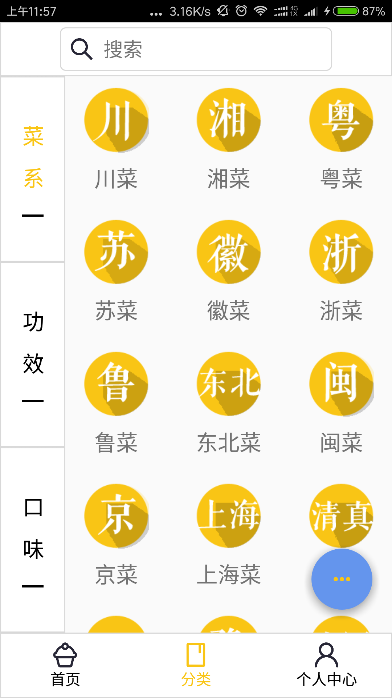
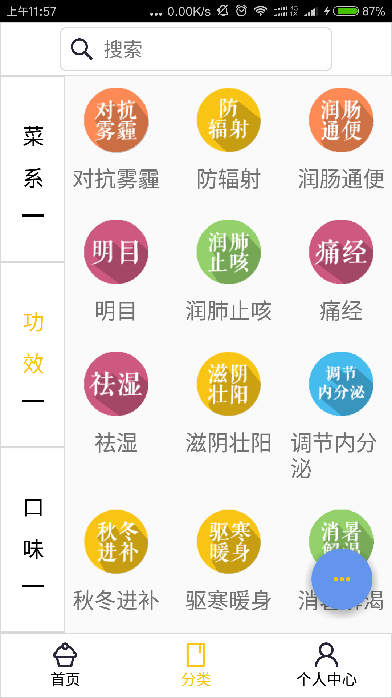

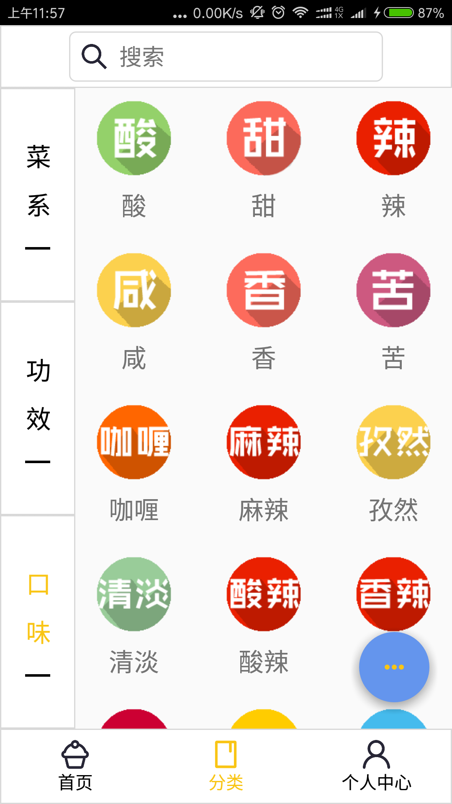
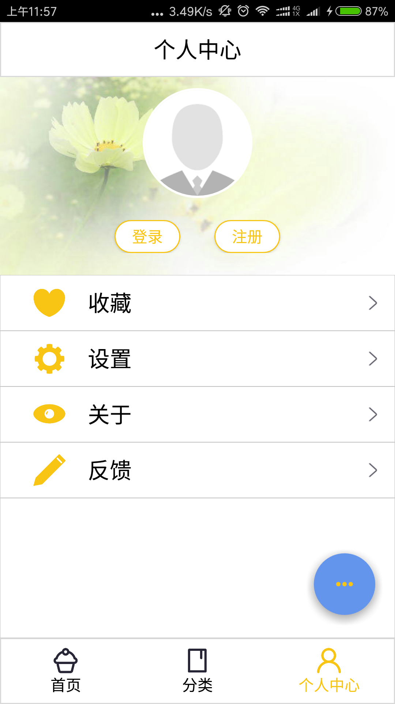
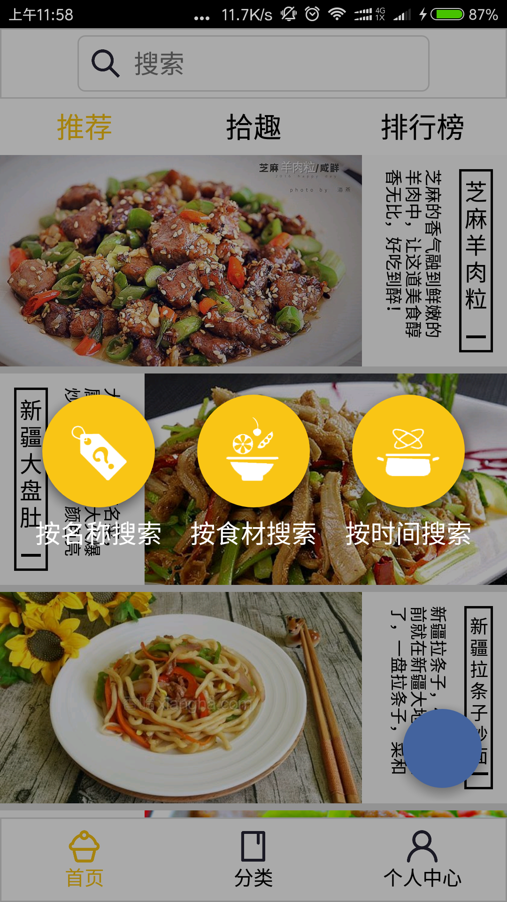

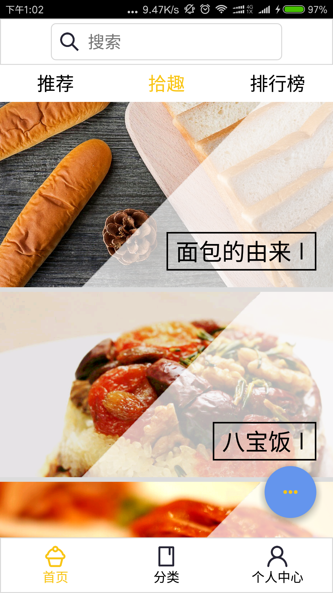

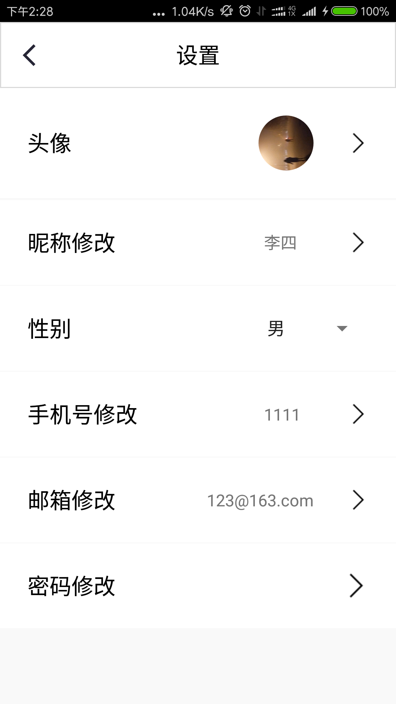
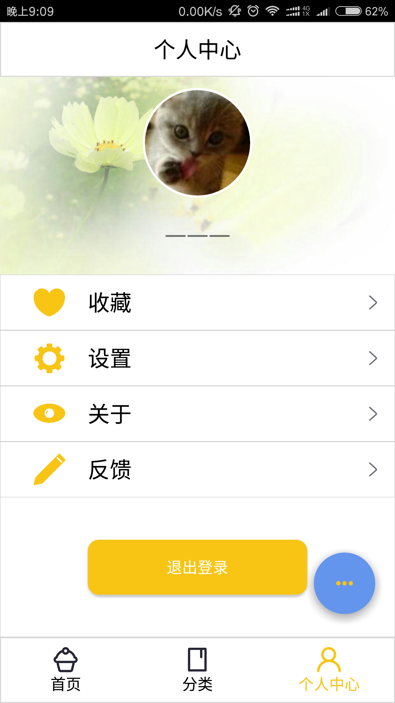